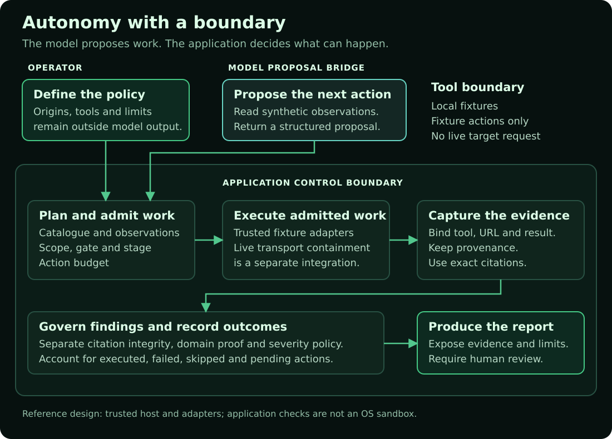
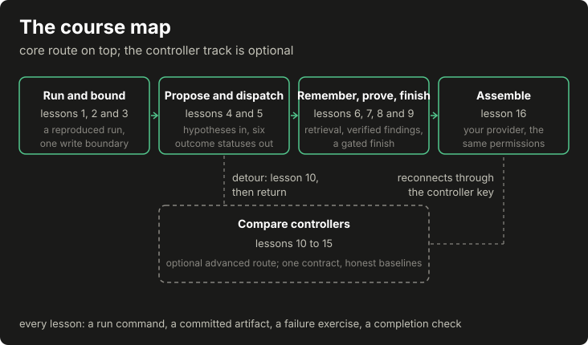

> 📖 **[Read the handbook online](https://mouteee.github.io/autonomous-offensive-llm-handbook/)**: follow the lessons from your first fixture run to an agent with clear limits.


# The model proposes, the code disposes

`AUTONOMOUS SECURITY / THE BUILDER'S FIELD MANUAL`

**[Read the website](https://mouteee.github.io/autonomous-offensive-llm-handbook/) · [Start the course](rendered/course/01-first-run.md) · [Run the lab](rendered/07-harness-lab.md) · [Connect your model](docs/CONNECT_YOUR_MODEL.md) · [The build sequence](docs/BUILD_ROADMAP.md)**

A practical handbook for building autonomous security agents with explicit limits on what a model may decide. Learn how to turn observations into a plan, admit only permitted actions, bind findings to evidence, and account for work that could not be completed.

The model remains probabilistic. The host application owns authorization, allowed actions, evidence records and acceptance. Replaying frozen inputs and policy can reproduce those control decisions; it does not make a live target or model response repeatable.


## Start here

You should be comfortable reading basic Python, JSON and HTTP. Follow [the core route](docs/BUILD_ROADMAP.md) from the [first run](rendered/course/01-first-run.md) through [the assembled application](rendered/course/16-package-your-agent.md). The dispatch lesson points you to a short baseline selection contract; the adaptive controllers are optional after the core build. Along the way, you edit [starter files](starter/README.md) and run checks that fail until your code works. The course runs offline without an API key or target connection.

The [reading website](https://mouteee.github.io/autonomous-offensive-llm-handbook/) presents the lessons in order, with navigation, diagrams and search. Use [the website guide](docs/WEBSITE.md) to build or preview it locally.

From a local copy of this repository:

```bash
python3 -m venv .venv
source .venv/bin/activate
python3 -m pip install -r requirements.txt
python3 -m harness.demo --out /tmp/harness-report.json
diff -u harness/report.json /tmp/harness-report.json
python3 -m pytest tests/test_harness.py
```

<!-- num-ok: 3.14 is the CPython interpreter version used for this release verification, a toolchain identifier rather than a target measurement -->
This release is verified on CPython 3.14. Earlier Python versions are not part of the release evidence; if you use one, run the complete gate sequence below before relying on the result.

When the report matches the committed example, `diff` prints nothing. Open the report and follow the header finding from its proposed severity to its governed severity. Then inspect the rejected raise and the synthetic marker's permitted raise. Both findings still require human review.

Read [the input manifest](harness/port.json), [the implementation](harness/runtime.py), and [the adversarial tests](tests/test_harness.py) beside [the example report](harness/report.json). You have completed this introduction when you can explain why an action was permitted, why a raise was refused, and what the report's coverage counts actually measure.

The default harness lab makes no network request and calls no model. Its proof predicate is synthetic, its host and adapters are trusted, and every finding is marked as requiring human review. The lab does not implement a person's acceptance or report-signing workflow. A verbatim quote establishes citation integrity, not exploitability. Fewer model calls and less rework are design objectives, not savings measured by the corpus.

## Connect your model

Your model supplies proposals. The application keeps policy and state, checks each proposal, runs permitted fixture actions and records the result. This repository gives you the application and exercises; you supply the model connection.

```text
your model -> JSON proposal -> application checks -> fixture tool -> evidence + report
                                  |
                             reject or stop
```

Run the assembled application with its fake model transport first:

```bash
python3 -m examples.app_agent --out /tmp/agent-report.json --store /tmp/agent-memory.db
python3 -m pytest tests/test_app_agent_example.py -q
```

Inspect the proposal statuses and evidence in `/tmp/agent-report.json`. Then follow **[Connect your own model](docs/CONNECT_YOUR_MODEL.md)** to use a local model or write a transport wrapper. The older [model bridge](examples/model_bridge.py) remains a smaller connection exercise with a different proposal format. Both examples keep tool actions on fixtures, including when a real model supplies the reply.

The guide names what to replace, the JSON to return, the checks to keep, the expected report and the remaining work before adding live tools.

## The control boundary

[](docs/assets/control-boundary.svg)

The diagram combines the lab's controls with the proposal connection. The model bridge exercises action admission and evidence capture; the default lab separately demonstrates finding governance. Neither is a complete live security agent.

## Build your agent in this order

[](docs/assets/course/build-path.svg)

Any diagram opens at full size when you click it; on a narrow screen you can also scroll it sideways.

This is the learning order. At runtime, authorization and the gate precede dispatch. Each lesson should leave you with a small component, an adversarial test, and an artifact you can inspect.

| Build step | Lessons | Current coverage |
|---|---|---|
| Run and trace a complete fixture run | [Lesson 1](rendered/course/01-first-run.md) | Runnable, byte-reproducible report |
| Bound the agent: policy, records, one write boundary, enforced stages | [Lessons 2 and 3](rendered/course/02-policy-and-records.md) | Runnable, with recorded refusals |
| Connect model proposals with validation and bounded repair | [Lesson 4](rendered/course/04-model-proposals.md) | Runnable fake provider; hostile-text refusal demonstrated |
| Select and dispatch work with distinct outcomes | [Lesson 5](rendered/course/05-candidates-and-dispatch.md) | Runnable; six-status ledger |
| Retrieve memory and assemble context without losing constraints | [Lessons 6 and 7](rendered/course/06-retrieval-and-memory.md) | Runnable; component scores and an omissions record |
| Verify evidence and review findings | [Lesson 8](rendered/course/08-evidence-and-verification.md) | Runnable; false rejections kept visible |
| Stop, recover and finish accountably | [Lesson 9](rendered/course/09-stop-recover-finish.md) | Runnable; resume never invents success |
| Assemble the application around your model | [Lesson 16](rendered/course/16-package-your-agent.md) | Runnable, configuration-driven, gated completion |
| Investigate adaptive selection after the core build | [Optional controller lessons](rendered/course/10-controller-laboratory.md) | Runnable controller laboratory, learning off by default |

Earlier components under `core/` (the flat modules) and `walkthrough/` preserve the historical case study, including known defects; the course's teaching packages live beside them under `core/run/`, `core/memory/` and `core/controller/`. Use the case study to understand why a control exists and what went wrong before it, and [the evidence register](rendered/appendix-f-evidence-register.md) for what the studies behind this book did and did not show.


## The course

| Lesson | Subject |
|---|---|
| [Run the whole thing first](rendered/course/01-first-run.md) ([source](handbook/course/01-first-run.md)) | A complete synthetic run, traced record by record, then deliberately broken |
| [Policy, records and the write boundary](rendered/course/02-policy-and-records.md) ([source](handbook/course/02-policy-and-records.md)) | Policy objects, record schemas, digests and the one recording door |
| [Stages and observations](rendered/course/03-stages-and-observations.md) ([source](handbook/course/03-stages-and-observations.md)) | The operational stage machine, its harness mapping and measured-or-unknown observations |
| [A model that proposes useful work](rendered/course/04-model-proposals.md) ([source](handbook/course/04-model-proposals.md)) | The provider wrapper, hypothesis validation, bounded repair and the hostile-text refusal |
| [Candidates and dispatch](rendered/course/05-candidates-and-dispatch.md) ([source](handbook/course/05-candidates-and-dispatch.md)) | Eligibility with reasons, deterministic ranking and the six-status executor |
| [Retrieval and persistent memory](rendered/course/06-retrieval-and-memory.md) ([source](handbook/course/06-retrieval-and-memory.md)) | Four-tier records, hybrid search with component scores, structured lanes and refutation |
| [Context assembly](rendered/course/07-context-assembly.md) ([source](handbook/course/07-context-assembly.md)) | Tier budgets, whole-block drops, expiry and the omissions record |
| [Evidence, verification and consolidation](rendered/course/08-evidence-and-verification.md) ([source](handbook/course/08-evidence-and-verification.md)) | Captures, an isolated verifier, host-validated verdicts and consolidation |
| [Stop, recover and finish](rendered/course/09-stop-recover-finish.md) ([source](handbook/course/09-stop-recover-finish.md)) | Budgets with owners, checkpoints, reconciliation and the gated finish |
| [The controller laboratory](rendered/course/10-controller-laboratory.md) ([source](handbook/course/10-controller-laboratory.md)) | One selection contract, the shared feedback signal and two baselines |
| [LinUCB step by step](rendered/course/11-linucb.md) ([source](handbook/course/11-linucb.md)) | The contextual bandit, worked by hand and recomputed by test |
| [The mushroom-body controller](rendered/course/12-mushroom-body-controller.md) ([source](handbook/course/12-mushroom-body-controller.md)) | Sparse coding, soft competition, habituation and replayable selection |
| [Plasticity, delayed credit and priors](rendered/course/13-plasticity-and-credit.md) ([source](handbook/course/13-plasticity-and-credit.md)) | Eligibility traces, clipped local updates and the prior bank's recorded defect |
| [Graph controller experiments](rendered/course/14-graph-controller-experiments.md) ([source](handbook/course/14-graph-controller-experiments.md)) | The experimental edge-plastic arm, its topology controls and its honest limits |
| [Comparisons and interpretation](rendered/course/15-comparisons-and-interpretation.md) ([source](handbook/course/15-comparisons-and-interpretation.md)) | Frozen manifests, raw-before-summary analysis and scoped readings |
| [Package an agent around your model](rendered/course/16-package-your-agent.md) ([source](handbook/course/16-package-your-agent.md)) | The assembled application, checks that remain stable when components change, and the gated finish |

## The chapters


| Chapter | Subject |
|---|---|
| [Chapter 00: The determinism gradient](rendered/00-thesis.md) ([source](handbook/00-thesis.md)) | Why variance is a design problem rather than a capability problem, the four layers, and the five laws |
| [Chapter 01: The fixed procedure](rendered/01-fixed-procedure.md) ([source](handbook/01-fixed-procedure.md)) | The stage machine, deterministic tool scoring, priors as counters in a file, and the turn ratio that does not say what you would want |
| [Chapter 02: One recording path](rendered/02-narrow-waist.md) ([source](handbook/02-narrow-waist.md)) | One writer per side effect, schema validation and the repair loop, and why claims and proposals need different gates |
| [Chapter 03: Asymmetric trust](rendered/03-asymmetric-trust.md) ([source](handbook/03-asymmetric-trust.md)) | A governor that cannot escalate, a verifier that can only raise against proof, and the attack chains that cannot be proved |
| [Chapter 04: Scope as code](rendered/04-scope-as-code.md) ([source](handbook/04-scope-as-code.md)) | Authorization as a function, the skip ledger, the floor no function should decide, and the scoping gap recorded in the selected run |
| [Chapter 05: What the scan could not reach](rendered/05-honest-reporting.md) ([source](handbook/05-honest-reporting.md)) | Reachability as a recorded value, coverage denominators, consolidation, honest partials, and how to evaluate your own system |
| [Chapter 06: Build your own](rendered/06-build-your-own.md) ([source](handbook/06-build-your-own.md)) | The ordered manual: every step states the invariant it protects, and names the enforcing file, a test and the committed artifact wherever the public tree carries them |
| [Chapter 07: The harness lab](rendered/07-harness-lab.md) ([source](handbook/07-harness-lab.md)) | The recommended offline reference: enforce the boundary, inspect a complete report, and test what must be refused |
| [Appendix A: The orchestrator contract](rendered/appendix-a-orchestrator-contract.md) ([source](handbook/appendix-a-orchestrator-contract.md)) | A generic contract for the instrument handed to the model |
| [Appendix B: The schemas](rendered/appendix-b-schemas.md) ([source](handbook/appendix-b-schemas.md)) | Tool-call, finding and governance-record shapes, with what each one guarantees and what it does not |
| [Appendix C: The failure museum](rendered/appendix-c-failure-museum.md) ([source](handbook/appendix-c-failure-museum.md)) | Real false positives with their root cause and the rule that kills each, and which of them this repository can pin |
| [Appendix D: The verifier study](rendered/appendix-d-verifier-study.md) ([source](handbook/appendix-d-verifier-study.md)) | A pre-registered two-arm study of the verifier against a public lab target: the design, the numbers, the six deviations, and what it still does not show |
| [Appendix E: The factorial study](rendered/appendix-e-factorial-study.md) ([source](handbook/appendix-e-factorial-study.md)) | A four-arm study switches the verifier and acceptance layer independently across two targets. It reports their separate effects, the pre-registered threshold the design missed, and the replication |
| [Appendix F: The evidence register](rendered/appendix-f-evidence-register.md) ([source](handbook/appendix-f-evidence-register.md)) | One card per study with execution, analysis, review and public-reproducibility status kept separate, the completed lab studies beside the originating project's corrected research record, and the one study still unrun |

<details>
<summary>The five laws and their enforcement limits</summary>

## The five laws


Canonical in chapter 00, copied here. Each is design intent, and the chapter named at the end of a law is where this system is held against it: which parts hold by construction, which hold on only one of the two orchestration paths, which hold on the orchestrator's good behaviour, and which do not hold yet.

<!-- num-ok: 404 is the HTTP status code for Not Found, a possible response to an invented endpoint rather than a guaranteed outcome; it identifies a response rather than counting anything, and the law is reproduced verbatim from handbook/00-thesis.md -->
1. **The model proposes; deterministic code disposes.** Give the model a proposal interface, not direct access to the target, raw storage or the last word on severity. Deterministic code validates, executes and records admitted work. The historical system does not enforce that boundary everywhere: both orchestrators can reach a shell, and its write path carries a subcommand that stores a finding without an execution. An invented endpoint might return 404, a login page or an application shell; record the response and judge the claim separately. A shared writer is not a sandbox. Chapters 01 and 02.

2. **Claims about the past must quote. Proposals about the future must execute.** These are different kinds of statement and they need different gates. A claim about something already observed must cite its own capture; a matching quote establishes citation integrity, not that the conclusion is true. The historical gate leaks: it keeps an item per batch even if none passes, and on one orchestration path a caller-supplied confidence can stand in for the check. A proposed test cannot be validated by quoting an observation it has not made. It may run only after authorization, scope, gate and budget checks permit it, and its outcome still needs interpretation. The law is not permission to execute every proposal. Chapter 02.

3. **Severity falls by default and rises only against proof.** The deterministic governor can lower a severity or mark a finding false-positive, and cannot raise one. That limits its authority; it does not make its conclusions correct. Under-reporting can hide a real vulnerability, so every lowering rule needs matching and counterexample tests and a reviewable reason. The historical raise endpoint checks a verbatim quote but does not enforce the authored score its contract requests. A quote alone is not exploitability proof. Bind the capture to the finding, apply a reviewed domain proof policy, and retain a separate human review and sign-off process. Chapter 03.

4. **Scope is a function, not a sentence.** Authorization written into a prompt competes with every other instruction in the context window. Encode the operator's permission as a reviewable policy and enforce it before every outgoing action, with a record of refusals. The historical guard falls short: it is asked at the tool boundary rather than at every request, broadens some host boundaries, and fails open under a kill switch or when constructed without a target. The lab rejects unlisted origins before its trusted callback, but transport containment still belongs in the adapter. A policy decision is only as correct as the authorization and destination it evaluates. Chapter 04.

5. **Report what you didn't do.** A scan that found nothing and a scan that could not reach anything are different scans, and a report that renders them identically is lying by omission. Coverage, gate status, and a ledger of every host skipped with its reason belong in the deliverable, next to the findings. That is a requirement the historical report did not meet: only coverage arrived, computed against its weakest denominator and under a label naming a different one. The lab accounts for planned tool-and-URL actions, executed work, errors and skips; that denominator does not measure vulnerability coverage. Chapter 05.

</details>

<details>
<summary>Historical case study and reference implementation</summary>

## Historical case study


The chapters below describe the earlier `core/` and `walkthrough/` implementation and its published defects. Their absent model-calling verifier remains absent from that historical path. The new `harness/` package is a separate offline control reference; it does not retroactively repair the corpus or the historical modules. Read chapter 07's boundary and corrections before copying a historical component.

Point a capable model at a host, hand it a toolbox and tell it to run a penetration test, and it will do something sensible. Run it again tomorrow and it will do something else sensible, and neither run can tell you why it skipped what the other one caught. This handbook argues for a smaller job for the model: give every decision to the cheapest layer that can make it correctly, and spend model capacity only where the answer genuinely is not derivable from what you already have. That ordering, from the decisions a table can make to the few that need a model, is the gradient in chapter 00's title. The chapters follow a working offensive-security agent and the controls its failures demanded.

The historical system has two orchestration paths. On the server-driven path an orchestrator keeps its own phase list and offers the model only the tools that phase allows. On the agent-driven path an orchestrating model plans the run and calls the tools itself, with the layers beneath it constructed but not always consulted. A shared write path makes recorded actions and findings reviewable, but an available shell can bypass it. An invented endpoint earns a captured response, not an automatic vulnerability verdict. The severity governor cannot raise; the separate verifier's historical raise gate checks a quote but does not establish exploitability. Authorization is asked at the tool boundary rather than at every outgoing request. The reporting chapters distinguish a scan that found nothing from a scan refused at the door. Those differences between intent and enforcement are part of the case study, not properties to copy into a new harness.

Every chapter after the first ends with a section on the control's costs and remaining gaps. The case study documents one system and its known control gaps. Appendices D and E report completed verification studies and attribute the measured effect to the model verifier. They do not test scheduler or ranking performance. The selected public-target run is an author-recorded aggregate with two exclusions documented beside it. Its raw findings, ground truth and matcher are not distributed, so its precision cannot be reproduced from this repository. Chapter 05 separates those observations from the untested design argument.

## The reference implementation


The historical code under `core/` is here to be read, run and disagreed with. It is an educational reference, deliberately non-functional as a live tester: the profiling, the relevance scoring, the scheduling and the tool-call validation are real and runnable, and everything that would put a packet on the wire is withheld. Run `ls core/*.py` to see what ships rather than trusting a figure written here, which is the kind of claim that goes stale the moment a module is added. The controls the later chapters lean on are among them: the write path is `core/store_protocol.py`, the severity governor `core/severity_governor.py`, the scope guard `core/scope_guard.py`, the gate check `core/gate_check.py`, and the stage machine `walkthrough/run.py`. The historical model-calling verifier is withheld. Chapter 06 specifies it; chapter 07 ships a separate deterministic evidence guard, not that verifier and not a human acceptance workflow. Keep their jobs apart: the grounding critic checks citation containment, the governor limits severity, and a raising path must satisfy an independently reviewed proof policy. None of them replaces human review and sign-off.

`walkthrough/` drives that stage machine over committed fixtures and writes the artifacts the chapters cite into `walkthrough/artifacts/`. Regenerate them with `python3 -m walkthrough.run`, which takes an `--out` directory if you would rather not touch the committed copies, and `tests/test_walkthrough_is_in_sync.py` compares a fresh in-memory run against those copies byte for byte, so a fixture edited without a re-run reddens instead of shipping. What that gate does not catch is an artifact that is wrong in both places, and its own docstring says so.

</details>

<details>
<summary>Measurements, evidence limits and repository verification</summary>

## The numbers


<!-- num-ok: Fourteen and thirty-five are each a spelled quantity counting one category of this repository's own num-ok annotations rather than anything measured on a target; 00 and 05 name the chapter ordinals bounding this census. The category counts are derived from annotation text and pinned in test_the_readme_census_of_its_own_annotations_is_the_real_one -->
Every figure in every chapter resolves to a key in `data/stats.json`, or carries an annotation naming what the figure is and why it is not a measurement taken from a target. Across chapters 00 through 05 and this README, fourteen annotations name a constant or a property of the code, thirty-five cover a spelled quantity the digit check cannot read, five name an HTTP status code, and one names a comparison between two of this repository's own published snapshots. The statistics file is a frozen snapshot with a published window, not a live query, and chapter 05 explains why re-running the pipeline would not reproduce it.

Chapter 05 reports the system's F1 against a public deliberately-vulnerable application and places it beside an OWASP ZAP passive-scan score. This repository proves the arithmetic and keeps the four aggregate score files synchronized with `data/stats.json`; it does not contain the raw findings, ground-truth entries, matcher, target identifiers or run identifiers needed to prove that the two tools were evaluated in a controlled head-to-head. Treat the pair as historical, author-recorded data points, not a fair benchmark. The sample size, the spread it therefore does not report, and the runs excluded from it with the reason each was excluded are all in that chapter.

A second measurement exists beside that pair, and it is a different kind of claim: a pre-registered two-arm study of the verifier (a model verifier plus the deterministic handling of its verdicts, ablated as a pair) against the same public lab target. Exact statistics throughout rather than a headline percentage, and a blinded-supported result on shipped precision whose human blind pass is still pending. It says nothing about money or time, and it is not the ranking-layer study chapter 05 still calls unrun. Chapter 05 and appendix D carry the design, the numbers, including corrected recall and severity-integrity accounting, and the limits of each result.

A generated copy of the chapters, with every figure resolved to its value in place and every code citation turned into a link into `core/`, lives in [the rendered tree](rendered/README.md) for reading on GitHub; it is produced by `scripts/render.py` and kept in step with the source by `tests/test_rendered_is_in_sync.py`.

If you are publishing the repository, follow [PUBLICATION.md](PUBLICATION.md). Publish a history-free snapshot into a new public repository; do not change the visibility of the development repository and assume a clean working tree has cleared its reachable Git history. The mandatory pre-commit `scripts/publication_gate.sh` refuses publication unless the private denylist was actually merged, the public Git author identity matches the approved value, and the staging repository has no prior refs, objects or reflogs.

`scripts/audit.sh` sweeps the repository for identifiers, `scripts/prose_check.sh` and `scripts/verify_claims.sh` sweep the prose, `tests/test_gates.sh` plants violations against them to prove they still fire, and the test suite holds the reference implementation against what the chapters say about it. A chapter is not finished until each of these passes:

```bash
python3 -m pip install -r requirements.txt
                                      # pytest, and nothing else: every module under
                                      #   core/ is standard library only
export HANDBOOK_ROOT=.
bash scripts/audit.sh .               # always the published patterns; the employer, client
                                      #   and host denylist only where it exists, and that
                                      #   file is private, so no clone carries it. Which
                                      #   half ran is in the "sanitization scope:" line
                                      #   this prints and not in the exit status, so read
                                      #   the line
./scripts/prose_check.sh handbook     # common prose patterns
./scripts/verify_claims.sh handbook   # citations, uncited numbers, cross-references,
                                      #   claim anchors, source attribution
./scripts/prose_check.sh README.md    # both gates take a target, and default to handbook/,
./scripts/verify_claims.sh README.md  #   so this file has to be named to be checked
./tests/test_gates.sh                 # the gates against planted violations, the
                                      #   tree, the README, and the chapter claims;
                                      #   the chapters' own prose is covered by the
                                      #   prose and claim gates aimed at handbook
                                      #   above, and not by this sweep
python3 -m pytest tests/              # the whole suite, and it prints its own count
                                      #   rather than having one written here. Every line
                                      #   above runs the gate scripts and the pytest files
                                      #   those wire in, which are the ones about this
                                      #   document; the tests of the controls the five laws
                                      #   are about: the severity governor, the scope
                                      #   guard, the gate check, the shared write path, the
                                      #   grounding critic, are reached by this line and
                                      #   by nothing above it. A break in one of them
                                      #   reddens the lines above only where it also moves
                                      #   the committed walkthrough artifacts
```

`tests/test_chapter_claims.py`, inside that suite, is the one worth stealing. It holds assertions against the reference implementation and the published statistics, and each is anchored to the verbatim sentence it backs, so an edit that changes a fact fails a test instead of quietly shipping.

</details>
