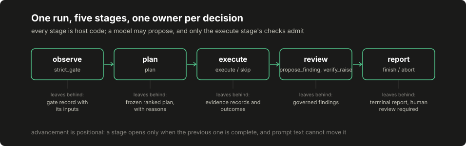

# Lesson 1: run the whole thing first

Before building anything, run a complete synthetic scan and read every file it leaves behind. The rest of the course modifies a system you have already seen work end to end, which is a different experience from assembling parts and hoping they meet. Nothing in this lesson needs an API key, a network connection or a target: the run is the offline fixture lab, and its whole point is that you can afford to break it.

## Build this

A working local installation, one complete fixture run whose report you can explain line by line, and one deliberately broken run that shows which input owns which output. You leave with the repository map and the run sequence in your head.

## Start from here

<!-- num-ok: 3 names the Python major version this repository targets, a toolchain identifier rather than a measurement -->
A machine with a recent Python 3 and a clone of this repository. Nothing else. The optional local-model connection comes later, in [connect your model](../../docs/CONNECT_YOUR_MODEL.md); live network adapters are not part of this repository at all.

## Inputs and outputs

The lab's inputs are two committed JSON files. `harness/port.json` is the policy manifest: the authorization reference and origin list, the observed profile, the tool catalogue with declared requirements and weights, the severity rules, and the proof rules with their markers. `harness/fixtures.json` is the world: canned responses the trusted adapters return. The output is one report, `harness/report.json`, carrying the gate record, the frozen plan, every action's outcome, the evidence table, the governed findings and the full event ledger.

The map of everything else:

```text
harness/     the offline lab this lesson runs: runtime, manifest, fixtures, report
examples/    the model bridge: a proposal function connected to the same lab
core/        flat modules: the historical reference implementation and its defects
core/run/    the course's agent: records, policy, stages, proposals, dispatch,
             verification, lifecycle and the assembled application (lessons 2-5, 8-9, 16)
core/memory/ the course's retrieval and context assembly (lessons 6-7)
core/controller/   the course's controller laboratory (lessons 10-15)
walkthrough/ the historical stage machine driven over committed fixtures
handbook/    chapter sources, with citation macros the gates verify
rendered/    generated reading copies of the chapters, macros resolved
data/        published statistics, study aggregates and course artifacts
docs/        website sources, diagrams, figures and the model connection guide
scripts/     the gates: prose, citations, sanitization, rendering, site build
tests/       the suite that holds all of the above together
```

Three labels to keep separate from the start: the offline lab (default, fixtures only), the optional model call (opt-in, still fixtures), and a live adapter (not shipped; a separately reviewed transport boundary in a later lesson).

## Implement it

1. **Create the environment and install.** From the repository root:

   ```bash
   python3 -m venv .venv
   source .venv/bin/activate
   python3 -m pip install -r requirements.txt
   python3 --version
   ```

   The lab's own modules use the standard library only; the single requirement is the test runner.

2. **Run the lab and prove it reproduced.**

   ```bash
   python3 -m harness.demo --out /tmp/harness-report.json
   diff -u harness/report.json /tmp/harness-report.json
   ```

   The `diff` prints nothing: your run is byte-identical to the committed report, because every input is committed and the runtime is deterministic.

3. **Run the model-connection smoke test.**

   ```bash
   python3 -m examples.model_bridge --out /tmp/model-bridge-report.json
   ```

   This drives the same lab through a proposal interface with a fake model that echoes the next planned action. It is a connection exercise, not an autonomous agent: the bridge admits the exact next scheduled action or records a stop, and nothing more yet.

4. **Read the run sequence.** Keep the diagram beside the report while you read it:

   [](../../docs/assets/course/run-sequence.svg)

## Inspect it

Open `/tmp/harness-report.json` and walk it top to bottom. `run_id` is a digest over the manifest and fixtures together, so the identifier itself says which inputs produced this run. `gate` holds the decision and, critically, the inputs it was taken from, so the decision is reconstructible. `plan` is frozen: ranked rows with a `score` and a `reason`, and the `not_selected` events in the ledger name each tool that did not qualify and why. `outcomes` uses three words that never blur: `executed`, `error`, `skipped`. `evidence` keys every capture by its own content digest. `findings` carries both `proposed_severity` and the governed `severity`, with `rules_fired` naming what moved it, and every finding says `human_review_required`.

Now trace two decisions through stable identifiers:

1. **One admitted action.** Take the first plan row's tool. Find its `authorized` event in `events`, its outcome in `outcomes`, and its capture: copy the outcome's `evidence_id` and look it up in `evidence`. The finding that cites this capture repeats that `evidence_id` and quotes a string you can see verbatim in the capture's `body`. That chain (plan row, authorization event, outcome, evidence digest, finding quote) is the spine of everything this course builds.

2. **One rejected proposal.** Read `demonstration_rejections`. The demo deliberately asks for a severity raise backed by a real quote that does not satisfy the independent proof rule, and the rejection records the finding, the rule it failed against and the reason. A true quotation was not enough, which is the point: citation integrity and proof are different checks.

## Break it

Change the world and watch which outputs own the change. Edit `harness/fixtures.json` and change the marker fixture's `LAB_CONFIRMED` text to `LAB_BROKEN`:

```bash
python3 -m harness.demo --out /tmp/broken-report.json
git diff --stat harness/fixtures.json
git checkout -- harness/fixtures.json
```

The run refuses to construct at all: `PolicyError: proof rule synthetic-lab-proof needs a matching positive fixture`, because the manifest validation checks that a proof rule's declared marker actually occurs in its positive fixture before any run starts. One near-miss is worth understanding before moving on: appending to the marker instead (`LAB_CONFIRMED_X`) would not break anything, because the proof predicate is substring containment and the suffixed text still contains the declared marker. A substring predicate matches more than you might mean, which is exactly the caution chapter 07 attaches to the lab's toy predicate. Restore the fixture and rerun to get the committed bytes back (a different world is a different `run_id`, not a noisier copy of the same run). Then try the suite's own adversarial cases:

```bash
python3 -m pytest tests/test_harness.py -q
```

## Check completion

- A clean clone produces the committed fixture report byte for byte, and the model bridge finishes with `finished` as its terminal event.
- For every outcome in the report you can point at the record explaining it: a gate input, a plan reason, a `not_selected` event, an evidence digest or a rejection reason.
- You can say which of the three labels (offline lab, optional model call, live adapter) applies to each command you ran, and why the third does not exist here.

## When it does not run

The five failures new environments actually hit, with the check and the fix. The commands in this course assume a POSIX shell (bash or zsh) on Linux or macOS, run from the repository root; on Windows, WSL matches the printed commands exactly.

| Symptom | Check | Fix |
|---|---|---|
| `ModuleNotFoundError: core` or `No module named examples` | `pwd` are you at the repository root? | `cd` to the clone's top directory; every printed command runs from there |
| `pytest: command not found` or an old Python | `python3 --version` | README's clean-install block: a virtual environment plus `pip install -r requirements.txt` |
| The memory lesson fails to start its store | the FTS5 preflight one-liner in lesson 6 | Use a Python built with standard SQLite (python.org, distro or Homebrew builds) |
| Model replies rejected as `malformed` | your wrapper's reply against the proposal schema in lesson 4 | Reply with exactly one JSON object matching the printed schema; `examples/app_agent.py` shows the wrapper that constructs it |
| `provider_error` on every proposal while the run still completes | the proposal statuses in the report, not the completion flag | The transport is unreachable: start your local model or drop `--model` to use the fake: a completed fixture run is not connection evidence |

## Continue

[Lesson 2](02-policy-and-records.md) rebuilds the policy objects and record schemas this run was inspecting, and routes every state change through one recording boundary you can put on trial. Deliberate simplification to carry forward: the lab's observation extractors are toy regular expressions over fixture text, and chapter 07 documents exactly what each one does and does not measure.
