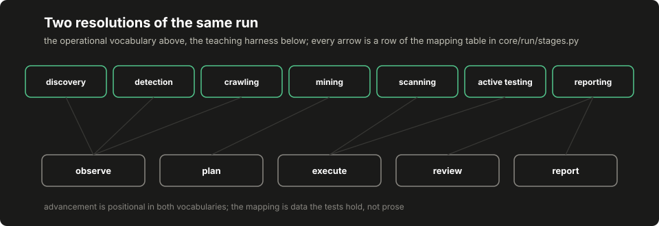

# Lesson 3: operational stages and observations

This reference implementation's operational vocabulary runs in seven stages, with names like discovery and active testing: a chosen methodology, not a law of engagements. The fixture lab's five stages are a teaching resolution of the same run. This lesson builds the operational machine, writes the correspondence between the two vocabularies down as data, and gives observations their own records, because the difference between "measured false" and "not measured" is where several of this book's historical defects lived.

## Build this

`core/run/stages.py`: the seven-stage operational machine with host-enforced, prerequisite-gated transitions; the mapping table onto the teaching harness's five stages; and observation records with a value, a state and a source. Plus the committed demo artifact holding a clean walk and two refused transitions.

## Start from here

[Lesson 2](02-policy-and-records.md) complete: the record vocabulary, the policy and the write boundary, with their tests green.

## Inputs and outputs

The two stage vocabularies and their correspondence, which the machine carries as data:

```text
discovery       -> observe        what exists?
detection       -> observe        what is it running?
crawling        -> observe        what surface does it expose?
mining          -> plan           which work does that surface imply?
scanning        -> execute        broad, low-interaction checks
active_testing  -> execute        targeted, higher-interaction checks
reporting       -> review, report findings review and the terminal report
```

An observation is a record, not a variable:

```json
{"field": "login_has_form", "value": true, "state": "measured",
 "source": "fixture:login"}
```

```json
{"field": "waf_vendor", "value": null, "state": "unknown", "source": ""}
```

Unknown is not false. An unknown field carries no value and satisfies no requirement, and a measured field names the source it was measured from, so a default can not masquerade as an observation.

A gate decision is a record too, and its fields answer different questions:

```json
{"status": "proceed", "mode": "full", "inputs": {"responses": 3, "errors": 0}}
```

`status` is what the observed world established (`proceed`, `limited` or `indeterminate`) and `mode` is what testing that permits: `full`, `passive` meaning no active tools, or `stop` meaning nothing runs. Pairing them is the host's mapping decision, and the assembly lesson's application maps a cleanly answering world to proceed and full, a partly-erroring one to limited and passive, and a world answering nothing but errors to indeterminate and stop. Unknown is not safe. The stage machine below reads the status; the dispatch door in lesson 5 reads the mode.

## Implement it

1. **Write the vocabulary down.** `[[code:run/stages.py:OPERATIONAL_STAGES]]` is the seven-stage order and `[[code:run/stages.py:HARNESS_MAPPING]]` is the correspondence table above, as data. Every operational stage maps onto the teaching harness's five stages, and the mapping is data the lesson can print. The row that widens is reporting, which covers both review and report. In the operational vocabulary, findings review happens while the report is assembled, and that compression is a labeled teaching simplification, not a claim about how a production pipeline should arrange it.

2. **Build the observation helpers.** `[[code:run/stages.py:measured]]` and `[[code:run/stages.py:unknown]]` produce the two record shapes, and `[[code:run/stages.py:observations_from_response]]` derives toy measurements from a fixture response: the same deliberate shape as the lab's extractors, labeled as derivations rather than as claims that a crawler ran.

3. **Gate the requirements.** `[[code:run/stages.py:requirements_met]]` answers whether a tool's declared requirements hold over the recorded observations, and its refusal reasons keep three cases apart: a field nobody observed, a field observed but unknown, and a field measured with the wrong value.

4. **Build the machine.** `[[code:run/stages.py:StageMachine]]` advances positionally (the requested stage has to be the next declared one) and each stage carries an entry prerequisite: detection needs at least one recorded observation, scanning needs a recorded gate decision, and active testing needs that gate to have said proceed or limited. A refused transition goes through the recorder's refusal door, so the ledger carries the transition the host declined next to the ones it made. Advancement is a host code path over recorded state; there is no input by which prompt text can move the stage.

5. **Run the demo.** `[[code:run/demo_stages.py:run_demo]]` walks one machine cleanly through all seven stages, then builds a fresh one and shows it refusing a jump straight to active testing and a detection attempt with no observations recorded.

## Run it

```bash
python3 -m pytest tests/test_run_stages.py -q
python3 -m core.run.demo_stages --out /tmp/stages-demo.json
diff -u data/course/stages-demo.json /tmp/stages-demo.json
```

## Inspect it

[](../../docs/assets/course/stage-mapping.svg)

Open `/tmp/stages-demo.json`. `clean_walk` is six advancement decisions, each `allowed: true` and each naming the harness stages it corresponds to, so the mapping table is visible in the artifact and not only in this chapter. `refusals` carries the two declined transitions with their reasons. In `refusal_report`, find the two `refused` events with kind `stage`: the machine's refusals live in the same ledger as everything else, which is what makes "the run never entered active testing" a statement the files can back. `action_requirement_with_missing_observation` is the requirement decision for a tool wanting a field nobody observed: not false, not failed. Not observed, in those words.

## Break it

```bash
python3 - <<'PY'
from core.run.demo_records import build_policy
from core.run.recorder import Recorder
from core.run.records import make_run
from core.run.stages import StageMachine, requirements_met

policy = build_policy()
run = make_run(policy.snapshot(), {"world": "break-it"})
recorder = Recorder(run, policy)
machine = StageMachine(recorder)

print(machine.advance("active_testing"))
print(machine.advance("detection"))
print(machine.current)
print(requirements_met({"has_form": True}, recorder.observations))
PY
```

Expected output:

```text
{'allowed': False, 'reason': "stage 'active_testing' is not the next declared stage (expected 'detection')"}
{'allowed': False, 'reason': 'detection requires at least one recorded observation'}
discovery
{'allowed': False, 'reason': 'has_form: not observed'}
```

The jump is refused with the expected next stage named; the in-order transition is refused too, because its prerequisite (an observation) does not exist yet; the machine is still standing where it started; and the action's requirement decision says "not observed", which is neither "false" nor "error". Four different absences, four different words.

## Check completion

- Every operational stage maps onto the teaching harness's five stages, and the mapping is data the lesson can print.
- An out-of-order transition is refused and recorded with the expected next stage named. The host enforces transitions; prompt text cannot advance the stage.
- Detection requires at least one recorded observation. Active testing requires a recorded gate decision of proceed or limited.
- A clean walk visits all seven stages in order and each advancement names its harness stages.
- An unknown observation does not satisfy a requirement, and a measured mismatch is reported as its own reason.
- Observation records carry a value, a state and a source, and an unknown value is honestly absent.

Each sentence is a named test in `tests/test_run_stages.py`; completion is that suite green plus the byte-identical `diff` above.

## Continue

[Lesson 4](04-model-proposals.md) finally puts a model on the other side of this machinery, proposing hypotheses over the observations this lesson recorded, through a wrapper whose admission rules are the host's.
