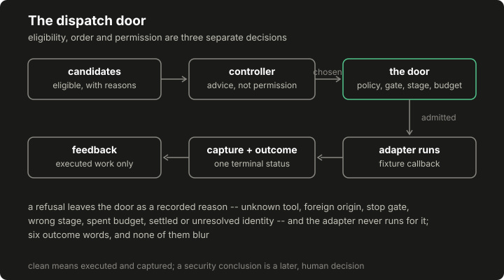

# Lesson 5: candidates, ranking and controlled dispatch

Between "this work is conceivable" and "this work ran" sit three separate decisions: eligibility, order, and permission. This lesson builds them as three separate pieces: a candidate table where every exclusion carries its reason and scope, a deterministic baseline ranking, and a dispatcher that re-asks the policy on every action no matter who chose it, and wires the controller laboratory from [lesson 10](10-controller-laboratory.md) into the same loop.

## Build this

`core/run/candidates.py` (construction, exclusion reasons with scopes, the documented baseline ranking) and `core/run/dispatch.py` (one action, an ordered plan, or a bounded batch through the recorder, with the six-status outcome vocabulary and a bounded response to unavailable tools). Plus the committed demo artifact whose ledger shows every status under its own name.

## Start from here

[Lesson 4](04-model-proposals.md) complete, plus one marked detour: read [lesson 10](10-controller-laboratory.md) from the top down to its bold core-route return line at the end of step seven (the four records, the feedback definition, the two deterministic controllers and the factory that builds them by name), then come straight back here. That is the whole excursion; nothing in this lesson needs the adaptive algorithms that follow it, and the core route continues from here to [lesson 6](06-retrieval-and-memory.md).

## Inputs and outputs

A candidate table lists eligible work and excluded work with reasons:

```json
{"eligible": [{"action_id": "form_probe -> https://lab.example:443/login",
               "family": "fam-inject", "priority": 4.0, "cost": 2.0}],
 "excluded": [{"action_id": "ancient_probe -> https://lab.example:443/login",
               "scope": "host",
               "reasons": ["tool 'ancient_probe' is unavailable on this host"]},
              {"action_id": "form_probe -> https://lab.example:443/",
               "scope": "destination",
               "reasons": ["has_form: observed False, requires True"]}]}
```

The two scopes answer different questions ("install the tool" against "this page has no form") and later lessons build habituation on exactly that difference. Dispatch answers with outcome rows from one six-word vocabulary, and the glossary is worth a minute before the first dispatch, because every later lesson leans on it:

| Outcome | What it states | What it does not state |
|---|---|---|
| `clean` | The adapter ran and its response was captured: execution success | Not "no vulnerability", not "useful", not a security judgment of any kind |
| `tool_error` | The adapter ran and raised | Nothing about the target; the error is the tool's |
| `tool_unavailable` | No adapter exists for the tool | Never target evidence |
| `skipped` | The host declined the work, reason recorded | Not a failure |
| `unresolved` | It may have run; the record cannot prove either way | Neither success nor failure; its own state |
| `verified_evidence` | A later verification bound evidence to the action | The one status carrying a reviewed claim |

Execution success, useful evidence and a security conclusion are three different facts: `clean` is only the first, `verified_evidence` is the second after review, and the third is a human's call at acceptance. When lesson 12's controller treats repeated `clean` results as fatigue-worthy, it is judging spend against progress. Not declaring the responses worthless and not declaring the target safe.

## Implement it

1. **Construct candidates.** `[[code:run/candidates.py:build_candidates]]` crosses observed surfaces with the declared catalogue: a tool whose requirements a surface satisfies yields a candidate carrying the normalized action identity from lesson 2 and the tool's family, weight and cost for the controllers. Host-scope and destination-scope exclusions stay distinct in the candidate table. A coverage obligation with no eligible candidate is reported, not dropped.

2. **Rank deterministically.** `[[code:run/candidates.py:rank]]` is the documented baseline: weight per unit cost, ties on the identity: the same rule as the fixture lab's planner and the legacy baseline controller, written as one sort key so it replays. The ranking is deterministic: weight per unit cost, ties on the identity.

3. **Dispatch through the door.** `[[code:run/dispatch.py:Dispatcher]]` pushes every action through the recorder's `action` door before anything runs, so the policy answers again at execution time, and the door reads the run's shared state on its own authority, not the caller's. Dispatch re-asks the recorded gate and stage: a stop gate admits nothing, a passive gate admits no active tool, and a staged run dispatches only in its executable stages. A bare component run with neither a gate nor a stage machine has no gate state to enforce (composing one in is the assembly lesson's step) and every other check here still applies. A registered adapter's result becomes a content-addressed capture and a `clean` outcome; an adapter that raises becomes `tool_error`; a missing adapter becomes `tool_unavailable`. A missing dependency does not become target evidence: an unavailable tool's outcome is tool_unavailable, never clean.

4. **Bound the waste.** Unavailability does not consume the action budget. Repeated unavailable work does not consume the entire budget: the re-queue bound turns it away after its limit. The counter's answer is a `not_requeued` row rather than another dispatch, so a missing binary costs a bounded number of ledger rows instead of the run.

5. **Keep selection and permission apart.** `[[code:run/dispatch.py:select_and_run]]` lets any controller from the laboratory choose among eligible candidates, then dispatches the choice through the same door as everything else. A controller cannot create a new permission: dispatch re-asks the policy for every action regardless of who chose it. An executed choice feeds the controller under the shared feedback definition, and a refused one feeds it nothing.

## Run it

```bash
python3 -m pytest tests/test_run_dispatch.py -q
python3 -m core.run.demo_dispatch --out /tmp/dispatch-demo.json
diff -u data/course/dispatch-demo.json /tmp/dispatch-demo.json
```

## Inspect it

[](../../docs/assets/course/dispatch-door.svg)

Open `/tmp/dispatch-demo.json`. The `candidates` table carries all three exclusion scopes: `host` for the tool nobody installed, `destination` for the form probe on the page with no form, and `coverage` for the obligation that produced no eligible candidate. The `ledger` reads like a taxonomy sampler: `clean` rows with capture identifiers, `tool_error` rows naming the exception type, `tool_unavailable` twice for the adapterless tool, `not_requeued` when its bound is spent, and a `skipped` row whose detail is the skip's reason. `controller_cannot_create_permission` is the crafted high-priority candidate for an out-of-scope destination: the controller picked it, and the door said no, with the refusal in the report's events and no learning applied.

## Break it

```bash
python3 - <<'PY'
from core.controller import make_controller
from core.controller.contract import Candidate, State
from core.run.demo_dispatch import ADAPTERS, build_policy
from core.run.dispatch import Dispatcher
from core.run.recorder import Recorder
from core.run.records import make_run

policy = build_policy()
run = make_run(policy.snapshot(), {"world": "break-it"})
dispatcher = Dispatcher(Recorder(run, policy), policy, ADAPTERS,
                        unavailable_limit=2)

crafted = Candidate(
    candidate_id="inspect_headers -> https://elsewhere.example:443/",
    family="fam-recon",
    features={"tool": "inspect_headers",
              "destination": "https://elsewhere.example/"},
    priority=99.0)
state = State(run_id=run.run_id, step=0, features={
    "bias": 1.0, "stage_progress": 0.0, "surface_known": 1.0,
    "recent_error_rate": 0.0, "budget_remaining": 1.0})
result = dispatcher.select_and_run(make_controller("priority"), state, [crafted])
print(result["status"], "|", result["reason"])
print(result["learning"])

plan = [{"tool": "dns_survey", "destination": f"https://lab.example/u{i}"}
        for i in range(4)]
print([r["status"] for r in dispatcher.run_plan(plan)])
repeat = dispatcher.dispatch("dns_survey", "https://lab.example/u0")
print(repeat["status"], "|", repeat["reason"])
PY
```

Expected output:

```text
refused | destination https://elsewhere.example:443 is outside the explicit authorized origins
{'applied': False, 'reason': 'the action was refused before execution'}
['tool_unavailable', 'tool_unavailable', 'not_requeued', 'not_requeued']
refused | action identity already has a recorded outcome (tool_unavailable); duplicates do not re-run
```

The crafted candidate had the highest priority in its list and a controller behind it, and neither fact opened the door. The unavailable tool got exactly its bounded allowance of ledger rows across distinct destinations, then answers `not_requeued` without dispatching: the loop a broken dependency would otherwise buy with the run's whole budget. And the last line is the duplicate rule from the completion list at work: the first destination's outcome is already terminal, so repeating that exact identity is refused at the door before the unavailability machinery is even consulted.

## Build it yourself

The thread completes: your tool, proposed in lesson 4's starter, now runs. Open `starter/lesson05.py` and build the pair of functions its docstring specifies: a fixture adapter whose body carries the marker `X-Meta-Notes: fictional-metadata-v1`, and `run_my_plan()`, which builds candidates over one metadata-bearing surface with your policy and dispatches every eligible row through the door. Then:

```bash
python3 -m pytest starter/lesson05_test.py -q
```

The starter's completion test fails on a fresh clone and passes only after your edit. Follow one identity through your own artifact: `inspect_metadata -> https://lab.example:443/about` appears as an eligible candidate, an authorized action, a content-addressed capture carrying your marker, and one clean outcome, linking declaration to evidence, all yours. The second test holds the boundary you did not have to write: the door still refuses your tool outside your origins. Worked answer: `starter/solutions/lesson05.py`.

## Check completion

- Host-scope and destination-scope exclusions stay distinct in the candidate table. A coverage obligation with no eligible candidate is reported, not dropped.
- The ranking is deterministic: weight per unit cost, ties on the identity.
- A missing dependency does not become target evidence: an unavailable tool's outcome is tool_unavailable, never clean. Unavailability does not consume the action budget.
- Repeated unavailable work does not consume the entire budget: the re-queue bound turns it away after its limit.
- A controller cannot create a new permission: dispatch re-asks the policy for every action regardless of who chose it.
- An executed choice feeds the controller under the shared feedback definition, and a refused one feeds it nothing.
- A skip carries its reason into the ledger. A bounded batch dispatches at most its bound, in plan order.
- Duplicates never repeat a side effect: an action identity that already carries a terminal outcome is refused at the door without running the adapter, and an unresolved one is refused the same way. Only reconciliation may revisit an unresolved one, and that path lives in lesson 9's lifecycle. An alias spelling of a settled destination cannot re-run the side effect.
- Dispatch re-asks the recorded gate and stage: a stop gate admits nothing, a passive gate admits no active tool, and a staged run dispatches only in its executable stages.
- A decision naming a candidate that was not offered is refused and recorded, not dispatched.

Each sentence is a named test in `tests/test_run_dispatch.py` or `tests/test_run_control_enforcement.py`; completion is those suites green plus the byte-identical `diff` above.

## Continue

[The retrieval and memory lesson](06-retrieval-and-memory.md) comes next in the build sequence, giving the agent something to remember between runs, and the controller pair in [lesson 10](10-controller-laboratory.md) and [lesson 11](11-linucb.md) is fully runnable against this dispatcher today. Deliberate simplification to carry forward: this dispatcher's budget counts executed attempts only, and the full lifecycle accounting (time, model calls, cost, cancellation and recovery) is the stop-and-recover lesson's subject.
