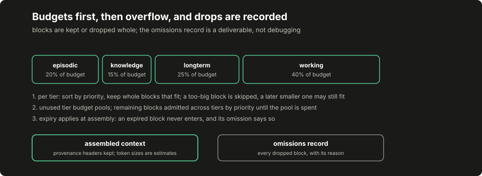

# Lesson 7: context assembly

Everything lesson 6 can retrieve is worthless until it reaches the model, and dangerous if it reaches the model unaccounted. This lesson builds the assembler: recalled and computed material becomes a set of candidate blocks, a budget decides what fits, and the output is two artifacts, not one: the context the provider will see, and the omissions record naming every block that did not make it and why. "The model was never shown the coverage warning" should be a line you can read in a file, not a reconstruction from a hunch.

## Build this

`core/memory/context.py`: the `ContextBlock` record, the source-to-tier mapping, per-tier budgets, the greedy fill with an overflow pool, expiry, and the omissions record. Plus the committed demonstration artifact assembling one block set at two budgets.

## Start from here

[Lesson 6](06-retrieval-and-memory.md) complete: the memory store, search and lanes, with their suites green. The blocks assembled here are the shapes those lanes and the run's own bookkeeping produce.

## Inputs and outputs

A block is a candidate piece of context with an identity, a source, a priority and a lifetime:

```json
{"block_id": "b-tactic-sqli", "source": "tactics",
 "content": "Learned tactic (proven, tactic:test_sqli:/api/*/items): union select in a JSON body bypasses the WAF on this stack.",
 "priority": 2.5, "created_at": 1700000000.0, "ttl_seconds": 0.0}
```

The assembler's answer carries both halves:

```json
{"context": "[coverage · b-coverage]\nRequired coverage: ...",
 "included": ["b-coverage", "b-tactic-sqli"],
 "estimated_tokens": 58, "total_budget": 120,
 "omissions": [{"block_id": "b-episode-stale",
                "reason": "tier budget exhausted; overflow pool exhausted"}]}
```

Every included block renders under a provenance header naming its source and identity, so a reader of the assembled context can trace any sentence back to the record that produced it.

## Implement it

1. **Define the block and its tier.** `[[code:memory/context.py:ContextBlock]]` maps its `source` to a tier through `[[code:memory/context.py:SOURCE_TO_TIER]]`; unrecognized sources land in working memory, the shortest-lived assumption. Token counts here are character-derived estimates under a named constant, not provider accounting: `[[code:memory/context.py:estimate_tokens]]` divides characters by `[[code:memory/context.py:CHARS_PER_TOKEN]]`, and the honest comparison is to run your provider's own tokenizer over an assembled context once and note the ratio, without wiring the provider into this module.

2. **Split the budget by tier.** `[[code:memory/context.py:TIER_FRACTIONS]]` is the originating implementation's split, kept verbatim:

   ```text
   working    0.40   the current run's own state comes first
   episodic   0.20   what recent runs did
   longterm   0.25   tactics that earned their keep
   knowledge  0.15   reference material
   ```

3. **Fill greedily, then spend the leftovers.** `[[code:memory/context.py:assemble]]` takes each tier's blocks in priority order and admits what fits that tier's budget. A too-large block is skipped while a later smaller one may still fit; the cut is per block, not a prefix. Whatever budget the tiers leave unused becomes one overflow pool that admits the remaining blocks across tiers by priority. Blocks are kept or dropped whole; nothing is truncated into a different claim.

4. **Honor expiry at assembly time.** A block whose lifetime has passed is omitted before any budgeting, with `expired` as its recorded reason. This is a labeled teaching correction: the originating implementation carries a time-to-live only in a cache path that nothing calls, so its assembler cannot expire anything in practice; here expiry runs where a reader can watch it.

5. **Record what was left out.** The omissions list is the deliverable that makes truncation auditable. Each entry names the block and the reason it fell: expired, its tier budget exhausted, the overflow pool exhausted. When a later run behaves as if it never knew something, this record answers whether it was never retrieved or retrieved and dropped.

6. **Keep authorization out of the prompt, structurally.** The assembler takes blocks and a number, and returns text and records. There is no policy parameter, no permissions field in the result, and nothing a block's content can do to either, which matters most for hostile recalled text. A remembered note that says to add a tool or expand a scope is rendered as exactly what it is, a remembered note under a provenance header. The proposal checks in the [model-proposals lesson](04-model-proposals.md) (lesson 4) refuse whatever a model does with it; scope and budgets never lived in the prompt to begin with.

## Run it

```bash
python3 -m pytest tests/test_memory_context.py -q
python3 -m core.memory.demo_context --out /tmp/context-demo.json
diff -u data/course/context-demo.json /tmp/context-demo.json
```

The `diff` prints nothing; the demo uses fixed timestamps, so the artifact is byte-stable.

## Inspect it

[](../../docs/assets/course/context-assembly.svg)

Open `/tmp/context-demo.json`. The block set carries every case this lesson argues about: a required-coverage note, fresh and stale session summaries, a proven tactic, two memory blocks that contradict each other, one block of hostile recalled text, an oversized crawl dump, and an already-expired rate-limit note. The same set is assembled at a budget of [[stats:course.memory.context_large_budget]] tokens and again at [[stats:course.memory.context_small_budget]].

At the large budget, [[stats:course.memory.context_large_included]] blocks make it in; the expired note and the oversized dump are the only omissions, each with its reason. At the small budget only [[stats:course.memory.context_small_included]] survive and the omissions record grows to [[stats:course.memory.context_small_omitted]] entries. A smaller budget changes what the model would see, and the omissions record names every dropped block with a reason. Notice what did not change between the two budgets: nothing about permissions, because there is nothing about permissions here to change.

Read the rendered context itself for the two disagreeing memory blocks. Two blocks that disagree are both included with their provenance, so the disagreement is visible rather than silently resolved; deciding which run to believe is analysis, and an assembler that quietly picked one would be doing analysis without a record. The hostile block reads the same way: hostile recalled text is carried as data under its provenance header; authorization lives outside the prompt entirely. The tests cover exactly these attacks (injected instructions in recalled content, expiry, oversized blocks, contradictions, budget starvation) and this lesson claims nothing about prompt-injection resistance beyond what those tests exercise: an instruction inside recalled text still reaches the model's eyes, and what it cannot do is move policy, because policy is not assembled from blocks.

## Break it

Shrink the budget until something you would miss falls out, and watch the record catch it:

```bash
python3 - <<'PY'
from core.memory.context import ContextBlock, assemble

blocks = [
    ContextBlock(block_id="b-coverage", source="coverage",
                 content="Required coverage: the orders API has not been "
                         "exercised this run; two planned actions remain.",
                 priority=3.0, created_at=0.0),
    ContextBlock(block_id="b-expired", source="tool_results",
                 content="Old rate-limit note.", priority=9.0,
                 created_at=0.0, ttl_seconds=10.0),
]
tight = assemble(blocks, total_budget=20, now=1000.0)
print(tight["included"])
for entry in tight["omissions"]:
    print(entry)
PY
```

Expected output: the required-coverage note is dropped and named, and the expired note never entered despite its high priority:

```text
[]
{'block_id': 'b-expired', 'reason': 'expired'}
{'block_id': 'b-coverage', 'reason': 'tier budget exhausted; overflow pool exhausted'}
```

Recalled and computed material is advisory, so a drop is legal; what would not be legal is a silent one. A host that treats coverage as an obligation reads the omissions record and reschedules the work: the record is what makes that possible.

## Check completion

- Blocks are kept or dropped whole; nothing is truncated into a different claim.
- An already-expired block never enters the context.
- A too-large block is skipped while a later smaller one may still fit; the cut is per block, not a prefix.
- A smaller budget changes what the model would see, and the omissions record names every dropped block with a reason.
- Two blocks that disagree are both included with their provenance, so the disagreement is visible rather than silently resolved.
- Hostile recalled text is carried as data under its provenance header; authorization lives outside the prompt entirely.

Each sentence is a named test in `tests/test_memory_context.py`; completion is that suite green plus the byte-identical `diff` above.

## Continue

The next lesson in the build sequence is [lesson 8](08-evidence-and-verification.md), the evidence and verification pipeline, where a tool result becomes a reviewed finding. The retrieval discipline this pair of lessons established (advisory data, visible provenance, recorded omissions, statuses kept separate) is the same discipline [the evidence register](../appendix-f-evidence-register.md) applies to the book's own studies. Deliberate simplification to carry forward: the tier split and the token divisor are the originating implementation's constants, not tuned values, and nothing here measures whether they are good ones.
