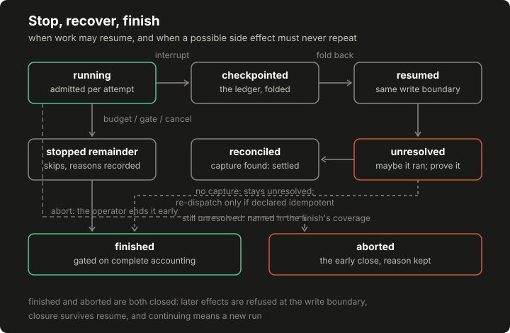

# Lesson 9: stop, recover and finish the run

A run that ends well is unremarkable; the design work is in the runs that do not. This lesson builds the machinery that makes every ending accountable: budgets that stop the loop with a named owner, retries that stay inside the record instead of rewriting it, a checkpoint a dead process can resume from, reconciliation that refuses to invent success, and a completion gate the originating implementation does not have. Two rules carry all of it. An outcome is a terminal fact. And missing evidence is missing. Not failure, not success, missing.

## Build this

`core/run/lifecycle.py`: named budgets, the retrying executor, cancellation and no-progress stops, checkpoint and resume through the write boundary, evidence-led reconciliation of interrupted actions, and the gated terminal report. Plus the committed demo artifact that interrupts a run mid-write and recovers it.

## Start from here

[Lesson 8](08-evidence-and-verification.md) complete: the verification pipeline runs and `tests/test_run_verify.py` is green.

## Inputs and outputs

The lifecycle consumes plan rows and produces three record shapes. A budget snapshot, where every limit has a named owner and exhaustion is an event:

```json
{"limits": {"actions": 10, "model_calls": 4, "wall_seconds": 600, "cost": 20},
 "used": {"actions": 4.0, "model_calls": 0.0, "wall_seconds": 0.0, "cost": 4.0},
 "exhausted": []}
```

A checkpoint, which is the recorder's snapshot plus the lifecycle's own counters. State is the ledger folded, not a pickle. And the terminal report:

```json
{"outcomes_by_status": {"clean": 2, "tool_error": 1, "unresolved": 1},
 "coverage": {"planned": 4, "terminal": 3,
              "unresolved": ["flaky_probe -> https://lab.example:443/ghost"]},
 "acceptance": "report acceptance is a separate human decision"}
```

## Implement it

1. **Name the budgets and their owners.** `[[code:run/lifecycle.py:Budgets]]` carries action, model-call, wall-clock and cost limits, each mapped to an owner in `[[code:run/lifecycle.py:BUDGET_OWNERS]]`. Budget exhaustion is an event with a named owner, and the remaining plan becomes recorded skips carrying that owner in their reason: an exhausted budget is an account entry, never a stack trace. The clock is injectable, because the wall clock is a budget like any other and a test has to be able to move it.

2. **Retry inside the attempt.** `[[code:run/lifecycle.py:Lifecycle]]`'s `execute_with_retries` runs its attempts first and records once. A retry is part of the attempt, not an edit to the record: an action gets one terminal outcome carrying its attempt count. The recorder's settle-once rule from lesson 2 is what forces this shape (an outcome, once terminal, is not rewritten) and the attempt-by-attempt story lives in the lifecycle's own attempts ledger beside the one outcome.

3. **Stop on purpose, at the attempt.** Cancellation stops the loop and accounts for what it stopped. No progress is a stop reason, not a loop: after a bounded streak of attempts that produce no new evidence, the plan's remainder becomes recorded skips naming the streak. All of it is asked before every attempt, not merely between plan rows: the executor re-checks cancellation, closure, elapsed wall time and the remaining action and cost budgets in one spot, `_blocked`, before the first try and before each retry, and re-asks the recorded gate and stage from lesson 3's door rule at the same points. So a caller that dispatches actions one at a time gets exactly the same stops as the plan runner, and a run that stops mid-attempt stops its own retry. A retry allowance never outspends the remaining action budget. And cost is checked as what it is: a number known before dispatch. An action whose declared cost exceeds the remaining allowance is refused before its adapter runs, and affordable work may still continue. That preflight is deliberately different from wall time, whose spend is only known after the call returns. The model-call budget is deliberately not on this list: spending it stops model calls where they happen, never already-planned actions.

4. **Checkpoint, and resume through the same door.** `checkpoint` saves the recorder snapshot, the budgets and the attempts ledger; `resume` rebuilds a fresh recorder by replaying the snapshot's own tables through `record`, the same write boundary everything else uses. A resumed run rebuilds through the same write boundary, and an interrupted action comes back unresolved. And the checkpoint carries the budgets already spent, so a resumed run cannot start its spending over: the control state folds back with the accounting. The executable stage survives checkpoint and resume. So does the gate: a run checkpointed outside its executable stages, or under a stop gate, does not resume into an open door. Two stated simplifications: authorized actions' arguments are not carried by the snapshot, and the checkpoint is a value rather than a durable file. Persisting it is packaging work, not semantics.

5. **Reconcile on evidence, and only on evidence.** `reconcile` walks the unresolved actions. One whose capture survived settles to its real outcome through the settle-once rule: the evidence was already on disk; only the outcome row was lost. One with no capture stays explicitly unresolved. Reconciliation settles an unresolved action only on evidence; missing evidence never becomes success. And the side effect may have happened, so an unresolved action is not re-dispatched unless its tool is declared idempotent: a declaration that belongs in the tool catalogue and lives, in this lesson, in the lifecycle's own table with that integration point stated. The declaration is worthless if anything else can route around it, so the rule is structural: ordinary dispatch refuses an unresolved identity; reconciliation is the only path that may repeat it, and only for a tool declared idempotent: the re-dispatch branch re-verifies the declaration itself before running the same admitted attempt loop as everything else. A repeat that the gate or budgets refuse leaves the action unresolved rather than relabeling it. The uncertainty is a fact, and a refused repeat is not evidence about it.

6. **Gate the finish, then close the door.** `finish` refuses while any authorized action lacks a terminal or explicitly unresolved outcome. Completion is refused while any planned action is unaccounted for, and this is the lesson's labeled teaching correction: the originating implementation's completion step is unconditional accounting, with nothing gating completion on outcomes, verdicts or coverage; its sequencing lives in an operator script outside the code. `abort` produces the same shape early: an aborted run gets the same accounting, under its abort reason, with pending work recorded as skipped. Either way the terminal record is terminal in both directions. A completed finish closes the run: a closed run refuses every later effect, and closure survives checkpoint and resume. Abort closes the run the same way, and a closed run refuses a second closure. There is deliberately no reopen (continuing work after a terminal report means a new run with its own accounting, the same property the fixture harness holds) and a completed run is still not an accepted report: acceptance stays a human review decision, recorded separately, exactly as lesson 8 left it.

## Run it

```bash
python3 -m pytest tests/test_run_lifecycle.py -q
python3 -m core.run.demo_lifecycle --out /tmp/lifecycle-demo.json
diff -u data/course/lifecycle-demo.json /tmp/lifecycle-demo.json
```

The `diff` prints nothing; the committed artifact is byte-identical to a fresh run.

## Inspect it

[](../../docs/assets/course/lifecycle-states.svg)

Open `/tmp/lifecycle-demo.json` and read it as three movements. In `movement_one`, the flaky tool pays on its second attempt (one `clean` outcome, `attempts: 2`) and the dead tool exhausts its retry budget into one `tool_error` outcome whose detail names the attempt count. In the middle, the artifact records the simulated crash: an action with a capture but no outcome, a second action with nothing at all, and `finish_refused_while_pending` showing the completion gate answering with the two unaccounted identities instead of a report. Then the resume: `reconciliation` settles the first action to `clean` because its capture survived, and leaves the ghost action `unresolved` with a recorded reason: the run cannot prove it did not fire, so it neither invents a success nor repeats the side effect. The `terminal` report counts it exactly that way: planned four, terminal three, one explicitly unresolved, and an `acceptance` line saying what completion is not.

## Break it

Interrupt a run between execution and recording, and watch what resume refuses to guess:

```bash
python3 - <<'PY'
from core.run.demo_lifecycle import FakeClock, build_policy, make_adapters
from core.run.lifecycle import Budgets, Lifecycle
from core.run.recorder import Recorder
from core.run.records import make_run

policy = build_policy()
run = make_run(policy.snapshot(), {"world": "break-it-nine"})
recorder = Recorder(run, policy)
lifecycle = Lifecycle(recorder, make_adapters(),
                      Budgets(actions=5, model_calls=2, wall_seconds=60, cost=9),
                      clock=FakeClock())

ghost = recorder.record("action", {
    "run_id": run.run_id, "tool": "steady_probe",
    "destination": "https://lab.example/ghost", "arguments": {}})
print(lifecycle.finish()["reason"])

resumed = Lifecycle.resume(lifecycle.checkpoint(), build_policy(),
                           make_adapters(), clock=FakeClock())
print(resumed.recorder.snapshot()["outcomes"][ghost["action_id"]]["status"])
print(resumed.reconcile()[0]["settled"])
print(resumed.finish()["completed"])
PY
```

Expected output:

```text
every planned action needs a terminal or explicitly unresolved state first
unresolved
unresolved
True
```

The action executed nothing, but the record cannot show that, so the lifecycle treats "may have executed" as its own state from authorization onward. The finish gate refuses first; resume gives the action an explicit `unresolved`; reconciliation finds no capture and leaves it that way rather than re-dispatching a possible side effect; and the run then completes with the unresolved action named in its coverage, not laundered into a success or quietly dropped.


### A fast failure is not a timeout

The plan's recorded-failure catalogue includes runs whose resource accounting charged a fast failure as though it had run long. The budgets here distinguish the two by construction, and the exercise is watching them do it: one adapter that dies instantly, one that eats the wall clock:

```bash
python3 - <<'PY'
from core.run.lifecycle import Budgets, Lifecycle
from core.run.policy import Policy, Tool
from core.run.recorder import Recorder
from core.run.records import make_run


class Clock:
    def __init__(self):
        self.now = 0.0

    def __call__(self):
        return self.now


def build(adapters, clock):
    policy = Policy(reference="duration-exercise",
                    origins=["https://lab.example/"],
                    tools=[Tool(tool_id="probe", activity="active")],
                    max_actions=10, max_model_calls=1)
    run = make_run(policy.snapshot(), {"world": "duration-exercise"})
    recorder = Recorder(run, policy)
    budgets = Budgets(actions=10, model_calls=1, wall_seconds=30, cost=50)
    return Lifecycle(recorder, adapters, budgets, clock=clock, retry_limit=1)


fast_clock = Clock()
fast = build({"probe": lambda url: (_ for _ in ()).throw(RuntimeError("boom"))},
             fast_clock)
result = fast.execute_with_retries("probe", "https://lab.example/a")
print("fast failure:", result["status"], "attempts:", result["attempts"])
print("fast wall used:", round(fast.budgets.used["wall_seconds"], 1),
      "blocked:", fast._blocked())

slow_clock = Clock()


def slow_probe(url):
    slow_clock.now += 20.0
    return {"status": 200, "body": f"slow response for {url}"}


slow = build({"probe": slow_probe}, slow_clock)
ledger = slow.run_plan([
    {"tool": "probe", "destination": "https://lab.example/a"},
    {"tool": "probe", "destination": "https://lab.example/b"},
    {"tool": "probe", "destination": "https://lab.example/c"},
])
print("slow statuses:", [row["status"] for row in ledger])
print("slow wall used:", round(slow.budgets.used["wall_seconds"], 1),
      "| stop:", slow.stop_reason)
PY
```

Expected output:

```text
fast failure: tool_error attempts: 2
fast wall used: 0.0 blocked: None
slow statuses: ['clean', 'clean', 'skipped']
slow wall used: 40.0 | stop: budget exhausted: wall_seconds (operator.wall_clock)
```

Read the two accountings against each other. The instant failure burned its retry allowance (both attempts in the ledger) and charged effectively nothing to the wall clock, so nothing is blocked and the run keeps its time. The slow adapter succeeded twice, but its second success carried the run past the wall budget, so the third action became a recorded skip naming the budget and its owner. A fast failure charged as elapsed time, or a timeout charged as an error count, each corrupt the resource story a comparison later reads: charge what the clock observed, and let the declared budget say who stops the run.

## Check completion

- A retry is part of the attempt, not an edit to the record: an action gets one terminal outcome carrying its attempt count.
- Budget exhaustion is an event with a named owner, and the remaining plan becomes recorded skips. The wall clock is a budget like any other.
- A retry allowance never outspends the remaining action budget, and a run that stops mid-attempt stops its own retry.
- An action whose declared cost exceeds the remaining allowance is refused before its adapter runs, and affordable work may still continue.
- Ordinary dispatch refuses an unresolved identity; reconciliation is the only path that may repeat it, and only for a tool declared idempotent. A repeat that the gate or budgets refuse leaves the action unresolved rather than relabeling it.
- A completed finish closes the run: a closed run refuses every later effect, and closure survives checkpoint and resume.
- Abort closes the run the same way, and a closed run refuses a second closure.
- The executable stage survives checkpoint and resume.
- A fast failure and a timeout are charged as what the clock observed: the first spends attempts and no wall time, the second spends wall time and stops the plan with its owner named.
- Cancellation stops the loop and accounts for what it stopped. No progress is a stop reason, not a loop.
- A resumed run rebuilds through the same write boundary, and an interrupted action comes back unresolved. Reconciliation settles an unresolved action only on evidence; missing evidence never becomes success.
- An unresolved action is not re-dispatched unless its tool is declared idempotent.
- The checkpoint carries the budgets already spent, so a resumed run cannot start its spending over.
- Completion is refused while any planned action is unaccounted for; an aborted run gets the same accounting, under its abort reason; and a completed run is still not an accepted report.
- Resume refuses a policy that is not the one the run was authorized under.
- Checkpoints carry a tamper-evident digest, verified before any state is folded. Tamper evidence is not tamper proofing: an editor who rewrites the body can recompute the digest, and the point is that silent corruption gets loud, not that the file is unforgeable.
- An evidence-bearing outcome with no capture in the checkpoint resumes as unresolved, with the refusal recorded.
- The wall-clock budget survives a checkpoint and resume; a restart does not hand time back.
- A refused capture surfaces the recorder's reason.
- Resume replays each authorized action once.

Each sentence is a named test in `tests/test_run_lifecycle.py`, `tests/test_behavior_review_fixes.py` or `tests/test_run_control_enforcement.py`; completion is those suites green plus the byte-identical `diff` above.

## Continue

The core lifecycle is closed: policy to records to stages to proposals to dispatch to verification to a terminal report. On the core route, [the assembly capstone](16-package-your-agent.md) is next. You already read lesson 10's contract on lesson 5's detour, and that is all assembly needs. The optional advanced route starts with the rest of [the controller laboratory](10-controller-laboratory.md). Deliberate simplification to carry forward: reconciliation here trusts the run's own capture table as its only evidence source; a production reconciler would also consult adapter-side logs and target-side effects, and the assembly lesson names that boundary when live adapters are discussed.
