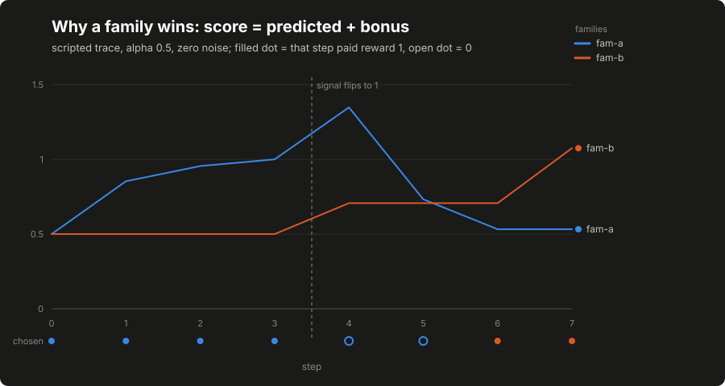
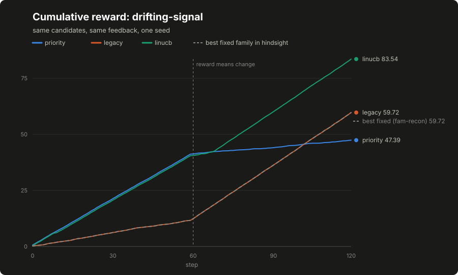

# Lesson 11: LinUCB step by step

The first adaptive policy on the laboratory contract is a contextual bandit. "Bandit" means it learns which option pays from the rewards of options it actually tried; "contextual" means the payoff estimate depends on the state features, not just a running average. LinUCB does both with nothing but linear algebra: a small matrix per hypothesis family, a predicted reward, and an uncertainty bonus that makes under-explored families worth trying. This lesson works the arithmetic by hand, then shows the same numbers coming out of the code.

## Build this

`core/controller/linucb.py`: a per-family linear model over the state vector, family selection by predicted reward plus uncertainty bonus, the shared within-family choice, on-policy updates keyed by decision, frozen mode, and snapshot round-trips. Plus the lesson's committed artifacts: a scripted eight-step trace and two world comparisons.

## Start from here

[Lesson 10](10-controller-laboratory.md) complete: the contract records, the feedback definition, the baselines and the laboratory runner, with `tests/test_controller_contract.py` green.

## Inputs and outputs

The bandit consumes the same `State` and `Candidate` records as every controller. What it adds is per-family state (one square matrix `A` and one reward vector `b` per family) and a per-family score record that the decision carries out for inspection:

```json
{"fam-a": {"predicted": 0.5, "bonus": 0.353553, "score": 0.853553},
 "fam-b": {"predicted": 0.0, "bonus": 0.5, "score": 0.5}}
```

`predicted` is what the learned model expects this family to pay in this state. `bonus` is how unsure the model still is about that family in this state. Their sum is the score, so a family wins either by paying well or by being unexplored, and which of the two carried a given win is visible in the record, not inferred.

## Half a page of vectors, if you need it

Skippable if dot products are old friends. The state vector `x` is a list of d numbers; the worked example below keeps d at two, the features named `bias` and `signal`. Per family, `A` is a d-by-d matrix starting as the identity (ones on the diagonal), and `b` is a d-vector of zeros. A dot product pairs two d-vectors into one number: multiply positionwise, add up. An outer product `x xT` pairs a d-vector with itself into a d-by-d matrix: cell (i, j) is `x[i] * x[j]`. "Solve A theta = b" asks which vector theta the matrix A maps onto b (conceptually a division by A) and starting A at the identity is what guarantees an answer exists before any data arrives (the identity is invertible; every update keeps it so). That is every operation this lesson uses. The solver's own implementation is a reference detail: read it if numerical code interests you, or trust its tests and stay with the controller's decisions: the first task here is explaining a selection, not implementing elimination.

## Implement it

1. **Write the solver.** `[[code:controller/linucb.py:solve]]` is Gaussian elimination with partial pivoting, and `[[code:controller/linucb.py:identity]]` builds the starting matrix. The matrices are the identity plus a sum of outer products, so they are always solvable; the pivot exists so a corrupted snapshot produces a loud error instead of a quiet wrong answer.

2. **Score a family.** `[[code:controller/linucb.py:family_score]]` implements the two equations this lesson is about:

   ```text
   theta = solve(A, b)
   score = dot(theta, x) + alpha * sqrt(dot(x, solve(A, x)))
   ```

   `theta` is the family's learned linear model, its dot product with `x` the predicted reward, and the square-root term the uncertainty bonus, scaled by `alpha`. A family nobody has tried keeps `A` at the identity and `b` at zero, so its prediction is zero and its bonus is `alpha * |x|`: exploration is priced in from the first step.

3. **Choose the family, then the candidate.** `_choose` scores every family that has an eligible candidate, takes the best with ties going to the lexicographically smaller family name, and then picks within the family by the same priority rule the baselines use, via `[[code:controller/contract.py:stable_best]]`. The bandit's entire contribution is the family choice; making the within-family rule shared is what keeps the comparison to the baselines about that choice and nothing else.

4. **Update on policy.** `_learn` applies

   ```text
   A <- A + outer(x, x)
   b <- b + reward * x
   ```

   to the family of the decision the outcome names, and only when the controller was built with `learn=True`. The base class from lesson 10 has already refused shadow decisions, unexecuted decisions, mis-addressed outcomes and replays before `_learn` is reached, so on-policy correspondence is a property of the contract, not of this method's vigilance.

5. **Freeze by default.** `[[code:controller/__init__.py:make_controller]]` builds the bandit frozen; frozen mode performs identical selection arithmetic and leaves `A` and `b` untouched, answering `learning is frozen` to every outcome. Research code opts in explicitly.

6. **Round-trip the state.** `snapshot` carries `alpha`, the learn flag, the observation count and every family's matrices; `restore` refuses a snapshot from a different controller name and reproduces scores exactly.

## The arithmetic, by hand

On the two-dimensional toy schema with `x = [1, 0]` and a fresh family:

```text
A = [[1, 0], [0, 1]]   b = [0, 0]
theta = solve(A, b) = [0, 0]
predicted = dot(theta, x) = 0
bonus = alpha * sqrt(dot(x, solve(A, x))) = alpha * sqrt(1) = alpha
score = alpha

after observing reward 1 on that decision:
A = [[2, 0], [0, 1]]   b = [1, 0]
theta = [0.5, 0]
predicted = 0.5
bonus = alpha * sqrt(1/2) = alpha / sqrt(2)
score = 0.5 + alpha / sqrt(2)
```

This is a toy calculation, not a benchmark. With `alpha = 0.5`, the committed trace shows exactly these values: the first score is [[stats:course.linucb_toy.initial_score]], and after one unit of reward the same family at the same `x` scores [[stats:course.linucb_toy.score_after_one_reward]], made up of predicted reward [[stats:course.linucb_toy.predicted_after_one_reward]] plus exploration bonus [[stats:course.linucb_toy.bonus_after_one_reward]]. `tests/test_controller_linucb.py` recomputes both by code next to this chapter's hand derivation, so the lesson's numbers and the implementation agree by test rather than by transcription.

## Run it

```bash
python3 -m pytest tests/test_controller_linucb.py -q
python3 -m core.controller.demo_linucb --out /tmp/linucb-trace.json
diff -u data/course/linucb-trace.json /tmp/linucb-trace.json
python3 -m core.controller.lab --world drifting-signal --out /tmp/compare-drift.json
diff -u data/course/compare-drifting-signal.json /tmp/compare-drift.json
```

Both `diff` commands print nothing. The figures below are generated from those committed artifacts by `scripts/make_course_plots.py`, and a sync test holds figure, statistics and artifact together.

## Inspect it

[](../../docs/assets/course/linucb-lesson-scores.svg)

Open `/tmp/linucb-trace.json`. Each step row carries the state vector `x`, both families' `predicted`, `bonus` and `score`, the chosen family and candidate, the scripted reward, and the attribution record saying whether learning applied. Read the scripted story off the rows: the run opens with both families at the bare bonus and the tie broken lexicographically; four rewarded steps teach the model that the first family pays in the `signal = 0` context; then the signal flips, the learned prediction keeps the stale family in front while it earns nothing, and after two empty steps the shrinking score crosses under the other family's standing bonus: the first `fam-b` choice lands at step [[stats:course.linucb_toy.first_fam_b_step]], after which its own reward takes over. That two-step lag is the honest price of a model that trusts what it learned; the bonus term is what keeps the price finite.

[](../../docs/assets/course/linucb-lesson-decomposition.svg)

The decomposition is the part worth staring at: every score above is just these two stacked terms, and the takeover step is won by a family whose predicted part is still zero. Nothing about the second family improved: the first family's certainty drained out of its own bar.

[](../../docs/assets/course/compare-drifting-signal.svg)

The comparison artifacts put the same policy against the lesson 10 baselines. On the steady world the bandit pays a small exploration tax: total [[stats:course.compare.steady-families.linucb.total_reward]] against the optimal static baseline's [[stats:course.compare.steady-families.priority.total_reward]], regret [[stats:course.compare.steady-families.linucb.regret]]. On the drifting world the ranking inverts: the static baseline rides the dead family down to [[stats:course.compare.drifting-signal.priority.total_reward]], while the bandit adapts to [[stats:course.compare.drifting-signal.linucb.total_reward]]: a regret of [[stats:course.compare.drifting-signal.linucb.regret]] against the best *fixed* family, negative because an adapting policy can beat any single family chosen with hindsight. And the legacy baseline lands exactly on the hindsight line at [[stats:course.compare.drifting-signal.legacy.total_reward]] by pure luck: its cost-aware rank favors the family that happens to win after the drift. A lucky static rank is indistinguishable from a good one on a single world, which is why comparisons run on more than one.

The variant implemented, stated precisely: disjoint LinUCB with one model per hypothesis family rather than per candidate, the state vector as the context, a fixed `alpha`, deterministic lexicographic tie-breaking, and a shared deterministic within-family rule. Two deliberate departures from the originating implementation, on top of the solver choice: its constructor default for `alpha` is a different constant (and its recorded campaigns ran a third), and its shared within-family rule prefers coverage obligations and untried candidates before score, where this lesson's rule is priority alone. That differs from [the original LinUCB formulation](https://arxiv.org/abs/1003.0146) (per-arm models over per-arm feature vectors, applied to news recommendation) in scope, not in arithmetic. Nothing on this page measures security outcomes; the rewards are the synthetic worlds' numbers. What the originating project's live campaigns found when policies like this selected real work (effective ties, and a tool-error confound worth more than the ranking) is recorded in [the evidence register](../appendix-f-evidence-register.md).

## Break it

Frozen mode first, because it is the default and the difference has to be visible:

```bash
python3 - <<'PY'
from core.controller import make_controller
from core.controller.contract import Candidate, Outcome, State

state = State(run_id="r", step=0, features={"bias": 1.0, "signal": 0.0},
              schema_version="toy-v1")
candidates = [Candidate(candidate_id="a", family="fam-a", priority=1.0)]
frozen = make_controller("linucb")
decision = frozen.select(state, candidates)
print(frozen.observe(Outcome(decision_id=decision.decision_id, candidate_id="a",
                             run_id="r", status="verified_evidence", feedback=1.0)))
print(frozen.family_score("fam-a", [1.0, 0.0]))
PY
```

Expected output: the reward is refused by name and the score is still the bare bonus, so the frozen controller provably learned nothing from being fed a reward:

```text
{'applied': False, 'reason': 'learning is frozen'}
{'predicted': 0.0, 'bonus': 0.5, 'score': 0.5, 'theta': [0.0, 0.0]}
```

Then the contract-level attacks from lesson 10, which apply here unchanged: interleave two selections and deliver their outcomes in reverse order (each lands on its own family), replay an outcome (applied once), and hand a learned family a vector of the wrong dimension (a loud error, not a reshape). Each has a named test in `tests/test_controller_linucb.py`.

## Check completion

- The lesson's initial score is exactly alpha, and the lesson's update produces the lesson's next score.
- Frozen mode performs the selection but leaves state unchanged.
- Interleaved decisions credit their own families, and a duplicate observation is not applied twice.
- The family wins on score and the candidate on priority, and equal family scores break ties lexicographically.
- A learned family refuses a vector of another dimension.
- Reset forgets learning and snapshot restores it.

Each sentence is a named test in `tests/test_controller_linucb.py`; completion is that suite green plus the two byte-identical `diff` runs above.

## Continue

[The next controller lesson](12-mushroom-body-controller.md) builds the sparse mushroom-body-inspired policy on the same contract, where the interesting machinery is habituation rather than a linear solve. Deliberate simplification to carry forward: this bandit updates by direct matrix accumulation rather than an incremental inverse, which is the readable choice at teaching scale and the slow one at production scale.
