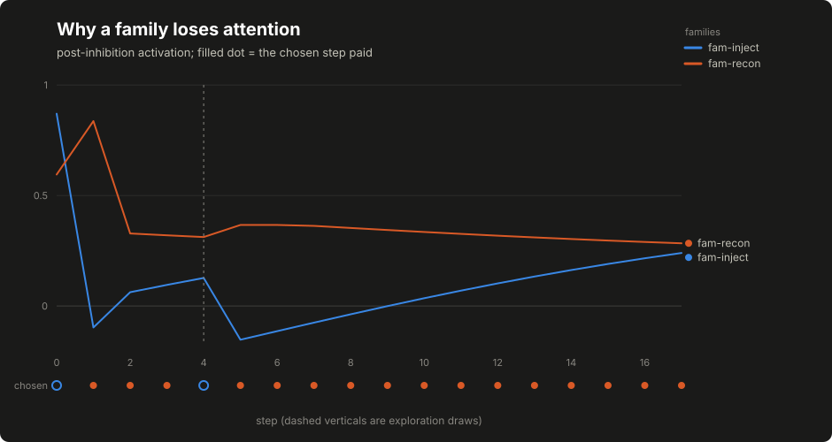

# Lesson 12: the mushroom-body-inspired controller

The second adaptive policy learns nothing at all, and that is the point of building it before its learning variant. It scores hypothesis families with a handful of legible terms: the host's prior, how much of the family is untried, a fixed random readout of the state, a fatigue penalty on work that keeps not paying, and cost, and everything interesting about it lives in that fatigue term. The design borrows its shape from the insect mushroom body, a small brain region that turns a wide sensory input into a sparse code and habituates to repeated unrewarding stimuli. Each borrowed idea is named once here beside its code equivalent, and the borrowing is an engineering analogy, not a brain simulation: see [the sparse fly-inspired computing work](https://www.its.caltech.edu/~jkenny/nb250c/papers/Dasgupta-2017.pdf) for where the encoding idea earns its keep in ordinary computing.

## Build this

`core/controller/mb.py`: a seeded sparse encoder (the analogy's Kenyon cells), a fixed random per-family readout, per-family signal assembly, soft lateral inhibition, deterministic epsilon-greedy exploration, and habituation keyed by what kept happening where. Plus the lesson's committed artifact: a scripted trace of [[stats:course.mb.steps]] steps in which the higher-priority family errors, is suppressed, and walks back toward contention as its penalty decays.

## Start from here

[Lesson 11](11-linucb.md) complete: the laboratory contract, the baselines and the bandit, with `tests/test_controller_contract.py` and `tests/test_controller_linucb.py` green.

## Inputs and outputs

Same contract records in; what this controller adds to the decision is a per-family term breakdown, so "why did this family win" is an arithmetic question with the arithmetic attached:

```json
{"fam-inject": {"prior": 0.6, "novelty": 0.5, "habituation": 0.467,
                "cost": 0.03, "w_dot": 0.003,
                "activation_before_inhibition": 0.386, "activation": 0.28,
                "size": 1},
 "winner": "fam-recon", "runner_up": "fam-inject",
 "margin": 0.11, "exploration": false, "kc_active": 10}
```

The borrowed terms map to code as follows. The insect analogy is optional background.

- An *expansion unit* (analogous to a Kenyon cell) is a row of `SparseEncoder`'s sparse sign matrix.
- The *sparse code* is the tuple of unit indexes returned by `encode(x)`.
- The *fixed readout* is `FixedReadout`'s per-family noise weights.
- *Habituation* is `Habituation`'s decaying fatigue counters. These change within an episode but are not learned weights.
- *Eligibility* and *modulation* enter with the learning variant in the next lesson.

Two mappings the records rely on. A candidate's destination URL travels in `features["url"]` and is bucketed by `[[code:controller/mb.py:surface_class]]` into a structural class; habituation keys on that class, a family and an outcome signature. A candidate that discharges a coverage obligation says so with a boolean `features["coverage_obligation"]`, which raises its family's prior by the documented boost. These are not fixture-only fields: The candidate builder supplies the fields this controller reads: url for the surface class and coverage_obligation for the declared boost. The builder's docstring is the one written contract, the assembled application's `coverage` configuration key is where an operator declares the obligations, and a producer that omitted these fields would silently disable surface habituation and the coverage prior, which is exactly what an earlier version of the builder did, caught by an independent review and pinned by an integration test since.

## Implement it

1. **Write the encoder.** `[[code:controller/mb.py:SparseEncoder]]` builds, from the seed alone, a fixed random projection: each of `n_kc` expansion units samples `claws` input dimensions with random plus-or-minus-one weights, and `encode(x)` keeps the top `k` among strictly positively activated units, returned as a sorted tuple that can be short or empty. In the analogy the units are Kenyon cells and `claws` is their input in-degree; in the code they are rows of a sparse sign matrix. The teaching scale is [[stats:course.mb.n_kc]] units with [[stats:course.mb.k_active]] active and [[stats:course.mb.claws]] claws; the originating implementation runs [[stats:course.mb.originating_n_kc]] units with [[stats:course.mb.originating_k_active]] active and [[stats:course.mb.originating_claws]] claws, and uses a numerical library where this lesson uses the standard library's generator. Both are deliberate teaching simplifications with the same semantics.

2. **Write the fixed readout.** `[[code:controller/mb.py:FixedReadout]]` holds per-family Gaussian weights over the units, seeded with `seed + 1` so it is decorrelated from the projection without a second knob, and `w_dot` answers the mean weight of a family over the active units. It is noise on purpose: at this stage the readout contributes texture, not knowledge, and the next lesson's learning has to beat exactly this floor.

3. **Assemble the per-family signals.** For each family with eligible candidates, `[[code:controller/mb.py:MushroomBodyController]]` computes: `prior`, the best candidate priority scaled into the unit interval, plus the coverage boost when owed coverage sits in the pool; `novelty`, the untried fraction of the family's candidates; `habituation`, the mean penalty over the family's distinct surface classes; `cost`, the pool's mean cost scaled down; and `w_dot`. The activation is their weighted sum:

   ```text
   activation = 1.0 * prior + 0.5 * novelty + w_dot
              - 1.0 * habituation - 0.1 * cost
   ```

4. **Apply soft competition.** Lateral inhibition subtracts a fraction of every other family's positive activation:

   ```text
   a'[h] = a[h] - kappa * sum(relu(a[j]) for j != h)    # kappa = 0.25
   ```

   Soft, not winner-take-all: the runner-up and the margin survive into the decision record, so telemetry can say how close the call was.

5. **Explore deterministically.** An epsilon-greedy draw (`epsilon = 0.05`) is seeded from the seed, the run and the step, so replaying a run replays its exploration; on an exploration step the winner is drawn uniformly from the sorted family names and the decision records `exploration: true`. The originating implementation seeds the draw from a hash of the scan state; run and step are this lesson's equivalent, and the difference is labeled here rather than hidden.

6. **Write habituation.** `[[code:controller/mb.py:Habituation]]` keys decaying counters by (surface class, family, outcome signature). Only two signatures habituate: `error` and `clean`, and be precise about what `clean` is, because lesson 5 defined it: a successfully captured response, execution success. It habituates here not because the response was worthless but because, for this controller's purposes, a family that keeps producing captures that never become findings is spending budget without advancing the run; the capture stays in the record and may still matter to review. Verified evidence is positive signal; a skip or an unavailable tool means the target was never touched; an unresolved execution has no observed response to habituate on, because missing evidence is not a target response. A clean response habituates at the documented fraction of an error's rate (the `CLEAN_WEIGHT` constant in the formula below), every select decays all counters, and the penalty saturates:

   ```text
   penalty = 1 - exp(-alpha * (H_error + 0.5 * H_clean))    # alpha = 0.7
   H <- rho * H per select                                  # rho = 0.9
   ```

7. **Update on outcomes, learning flag or not.** The habituation update in `_learn` runs for every executed outcome of this controller's own decisions (the contract base class already refuses everything else) and it runs whether or not any learning is enabled, because fatigue is episode dynamics, not learning. The controller still answers `applied: false`: it has no learned weights for credit to apply to.

8. **Rebuild from history.** `[[code:controller/mb.py:MushroomBodyController]]`'s `hydrate` replays an ordered event list (one decay per event, one observe where a signature is present) so a restarted host reconstructs the same habituation state the live episode had, and `snapshot`/`restore` round-trip the rest.

## Run it

```bash
python3 -m pytest tests/test_controller_mb.py -q
python3 -m core.controller.demo_mb --out /tmp/mb-trace.json
diff -u data/course/mb-trace.json /tmp/mb-trace.json
```

The `diff` prints nothing; the committed trace is byte-identical to a fresh run.

## Inspect it

[](../../docs/assets/course/sparse-encoding.svg)

[](../../docs/assets/course/mb-lesson-activation.svg)

Open `/tmp/mb-trace.json` and read the scripted story. The injection family opens with the higher prior and wins the opening step, errors, and is suppressed from step [[stats:course.mb.first_switch_step]] on while the recon family's verified evidence leaves its own habituation untouched. A deterministic exploration draw re-touches the suppressed family at step [[stats:course.mb.exploration_steps.0]] (the trace records `exploration: true` on that row) and the fresh error pushes its penalty to a peak of [[stats:course.mb.peak_inject_penalty]]. From there nothing but decay happens to it: by the final step the penalty has fallen to [[stats:course.mb.final_inject_penalty]] and its activation of [[stats:course.mb.final_inject_activation]] is closing on the incumbent's [[stats:course.mb.final_recon_activation]]. That is the whole mechanism in one trace: a family loses attention because its surface kept erroring, and regains it by resting, at a rate you can read off the constants.

[](../../docs/assets/course/mb-lesson-signal-breakdown.svg)

Why each term exists, in one sentence each: the prior keeps the host's opinion in play; novelty keeps untried work attractive without a matrix in sight; the fixed readout gives the next lesson's plasticity a floor to beat; habituation is the mechanism this controller exists to demonstrate; and cost keeps expensive families from winning on enthusiasm alone.

## Break it

Feed the habituation everything that must not move it, then the one thing that must, then hand the controller a vector from the wrong schema:

```bash
python3 - <<'PY'
from core.controller import make_controller
from core.controller.contract import Candidate, Outcome, State

def state(step):
    return State(run_id="r", step=step, features={
        "bias": 1.0, "stage_progress": 0.5, "surface_known": 1.0,
        "recent_error_rate": 0.0, "budget_remaining": 0.5})

api = Candidate(candidate_id="probe:x", family="fam-a", priority=5.0,
                features={"url": "https://lab.example/api/x"})
c = make_controller("mb")
for step, status in enumerate(("verified_evidence", "skipped",
                               "tool_unavailable", "unresolved", "tool_error")):
    d = c.select(state(step), [api])
    r = c.observe(Outcome(decision_id=d.decision_id, candidate_id="probe:x",
                          run_id="r", status=status, feedback=0.0))
    print(status, "->", r["habituation"]["penalty_after"])

toy = State(run_id="r", step=9, features={"bias": 1.0, "signal": 0.0},
            schema_version="toy-v1")
try:
    c.select(toy, [api])
except ValueError as exc:
    print("refused:", exc)
PY
```

Expected output:

```text
verified_evidence -> 0.0
skipped -> 0.0
tool_unavailable -> 0.0
unresolved -> 0.0
tool_error -> 0.503415
refused: encoder was built for dimension 5, got a vector of dimension 2
```

Four statuses that are not an observed target response of the habituating kinds leave the penalty at zero; the first error moves it; and a state vector from a different schema is refused loudly rather than reshaped quietly, because a projection built for one dimension has no honest answer for another.

## Check completion

- Identical frozen inputs and seeds replay the selection.
- Only an error or a clean response habituates; verified evidence, skips, unavailable tools and unresolved executions do not.
- The penalty saturates below one and decays every select, so a suppressed family drifts back into contention.
- The winner is chosen after lateral inhibition and the runner-up and margin stay in the record.
- A coverage obligation raises a family's prior by the documented boost.
- The encoder keeps at most `k` units and only positively activated ones.
- Rebuilding from the event history reproduces the habituation state.
- An exploration draw is deterministic under the seed and is recorded on the decision.
- The surface class buckets a destination by kind, depth and query shape.
- A learned dimension is pinned at first use and another dimension is refused loudly.
- A habituation key that cannot round-trip the snapshot is refused loudly instead of silently dropped.
- Frozen keeps the learned state empty while habituation and the step counter still move: episode dynamics are not learning, and a frozen controller is not bit-frozen.

Each sentence is a named test in `tests/test_controller_mb.py` or `tests/test_behavior_review_fixes.py`; completion is that suite green plus the byte-identical `diff` above.

## Continue

[Lesson 13](13-plasticity-and-credit.md) switches on the one learning site this controller reserves: the readout weights from active units to families. Deliberate simplifications to carry forward: the teaching-scale encoder, the run-and-step exploration seed, and a within-family choice by priority alone where the originating implementation also prefers coverage obligations and untried candidates first.
