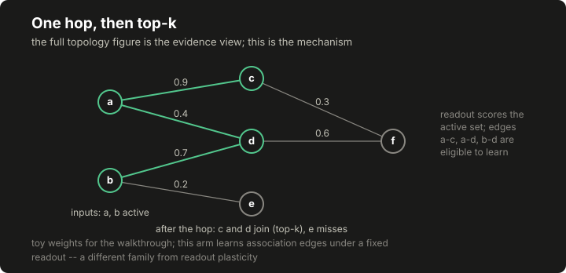

# Lesson 14: the graph controller experiments

This lesson builds the course's one explicitly experimental arm: a controller that expands the state vector onto the nodes of a graph, propagates activation across one weighted hop, and reads family scores off whatever ends up active. It exists to answer mechanism questions (where does learning live, and what do topology controls look like) not to ship. Keep one boundary sharp the whole way through: this arm's plastic site is the graph's association edges, and [lesson 13](13-plasticity-and-credit.md)'s plastic site is unit-to-family readout weights. Same update rule, different home, and the difference is the entire experiment.

## Build this

`core/controller/graph.py`: a frozen toy graph loaded from a committed fixture, a seeded sparse projection onto its nodes, a single weighted hop with learned edge weights added in, a fixed random family readout over the final active set, degree-preserving and density-matched topology controls, a no-hop control, and a per-arm parity record. Plus `core/controller/demo_graph.py` and the committed five-arm demonstration it produces.

## Start from here

[Lesson 13](13-plasticity-and-credit.md) complete: the eligibility and update classes this arm reuses exist, and `tests/test_controller_plasticity.py` is green.

## Inputs and outputs

The topology is data, not code: `data/course/graph-toy.json` declares [[stats:course.graph.nodes]] nodes and [[stats:course.graph.edges]] directed weighted edges, authored for this lesson, fictional, and mapping to nothing biological. The originating experiments ran the same mechanism over a measured fly connectome at a very different scale:

```text
originating freeze: roughly 13,500 nodes and 500,000 directed weighted edges
(measured Drosophila connectome; artifact and license not distributable here)
this lesson's toy:  40 nodes, 150 edges, authored fiction
```

Measured topology enters only when its artifact, license, provenance and node mapping are all verified and distributable; none of that holds here, so the public path is toy topology plus controls, which is also exactly what the mechanism questions need. The controller consumes the same `State` and `Candidate` records as every other policy, and its decision's `scores` carry the arm name, per-family readout values, the sizes of both active sets and the co-activation key count, so a reader can see what the hop did.

## Implement it

1. **Freeze the topology.** `[[code:controller/graph.py:ToyGraph]]` loads the fixture, refuses out-of-range edges, and computes the `w95` normalization anchor (`[[code:controller/graph.py:w95]]`): the hop divides raw edge weights by the toy graph's own upper-percentile weight, and every control arm receives the toy arm's anchor rather than computing its own, so the three arms' hop magnitudes stay comparable.

2. **Project and hop once.** `[[code:controller/graph.py:forward]]`, on the graph controller, projects the state vector onto nodes through a seeded sparse plus-or-minus-one map (a few input dimensions per node), keeps the top active nodes among strictly positive ones, then adds one hop: every edge out of a step-zero active node contributes `w_norm + learned` to its target. The final active set is the top of the combined activation, and the co-activation keys (step-zero active source, final-set target) are the edges the hop actually used.

3. **Read out and choose.** A fixed random readout per family (seeded, small Gaussian weights over nodes) is averaged over the final active set; the best family wins with lexicographic ties, and the candidate inside the family is chosen by the same priority rule every lesson uses. The readout never learns. That is the design invariant separating this arm from lesson 13: learning changes which nodes are active, never how active nodes are read.

4. **Learn on the edges.** `[[code:controller/graph.py:EdgeEligibility]]` reuses lesson 13's decaying-trace class with association edges as keys, depositing on the co-activation keys of each non-shadow selection, and `_learn` applies the identical clipped three-factor rule through the imported `[[code:controller/graph.py:LearnedWeights]]`, reused by import rather than retyped, so the two lessons cannot drift apart on the rule. Lesson 13's refusal unwind travels with the reuse: a selection the host reports as not executed has what remains of its edge deposit subtracted exactly, so a later outcome cannot credit edges only a refused selection co-activated. The plastic site label travels in every learning report and in the parity record: `association_edges`.

5. **Build the controls.** `[[code:controller/graph.py:shuffled_variant]]` rewires by degree-preserving double-edge swaps (a fixed number of attempts per edge), keeping every node's in and out degree while destroying the wiring pattern; `[[code:controller/graph.py:random_variant]]` redraws the wiring entirely, preserving only node count, edge count and the weight multiset; `hop=False` is the no-hop control, whose final active set is its step-zero set and which therefore has no co-activation keys and nothing for edge learning to hold onto. The frozen arm gates both the deposit and the update.

6. **Disclose per arm.** `[[code:controller/graph.py:parity]]` reports nodes, edges, the plastic site, how many edges hold learned weight, the clipped fraction and the median learned magnitude: the record that makes "learning barely moved" and "learning saturated" visible instead of anecdotal.

## Run it

```bash
python3 -m pytest tests/test_controller_graph.py -q
python3 -m core.controller.demo_graph --out /tmp/graph-demo.json
diff -u data/course/graph-demo.json /tmp/graph-demo.json
```

The `diff` prints nothing: five arms, one seed, one synthetic world, byte-identical to the committed artifact.

## Inspect it

[](../../docs/assets/course/graph-hop.svg)

[](../../docs/assets/course/graph-topology.svg)

Open `/tmp/graph-demo.json`. The world is `decoy-delay`: a family the host rates highest that pays a small penalty every time, a paying family whose feedback arrives steps late, and a middling third. On this seed, the toy learning arm starts on the decoy like everything else, and the modulation from the decoy's penalties depresses exactly the co-activated edges; after enough depression the active set shifts and the arm leaves the decoy [[stats:course.graph.toy_side_picks]] times against the frozen arm's [[stats:course.graph.frozen_side_picks]], ending at [[stats:course.graph.toy_total]] against the frozen arm's [[stats:course.graph.toy_frozen_total]]. Read the parity records alongside: the toy arm holds learned weight on [[stats:course.graph.toy_learned_edges]] edges with a median magnitude of [[stats:course.graph.toy_median_abs_learned]], while the random control learned on [[stats:course.graph.random_learned_edges]] edges, clipped a [[stats:course.graph.random_clipped_fraction]] fraction of them, and stayed on the decoy anyway.

The toy arm escaped to the middling family, not the paying one, and its total is still negative. The shuffled and random controls behaved differently on this single seed. This run shows edge updates changing selections; it does not establish an advantage for the toy topology. The [evidence register](../appendix-f-evidence-register.md) records the separate historical studies: the graph campaigns ended setup-inconclusive. Their one qualified mechanism positive used score-bearing readout plasticity on a random toy graph, not the association-edge learning implemented in this lesson. Measured topology did not separate from shuffled or random controls there. Credit-gating and weight-decay variants were rejected or parked. The runs on this page are new synthetic teaching examples, not reproductions of that positive result.

## Break it

Prove the learning site is where the lesson says it is:

```bash
python3 - <<'PY'
from core.controller.demo_graph import build_arms
from core.controller.research import run_condition
from core.controller.worlds import make_world

arms = build_arms()
toy = arms["toy"]
run_condition(toy, make_world("decoy-delay", seed=7))
edge_set = {(pre, post) for pre, post, _ in toy.graph.edges}
learned = toy._weights.weights()
print("learned keys are edges:", set(learned) <= edge_set)
print("readout rows learned:", any(k not in edge_set for k in learned))

frozen = arms["toy-frozen"]
run_condition(frozen, make_world("decoy-delay", seed=7))
print("frozen learned:", frozen._weights.weights())
print("frozen traces:", frozen._elig.traces())
PY
```

Expected output:

```text
learned keys are edges: True
readout rows learned: False
frozen learned: {}
frozen traces: {}
```

Then hand the arm a state vector of the wrong dimension after its first selection and it refuses loudly rather than reshaping, the same pin the bandit carries.

## Check completion

- Identical seeds and identical frozen inputs replay the same choices.
- The frozen arm's learned weights stay at zero and its traces stay empty.
- The shuffled control preserves every node's in and out degree, and the random control preserves the node count, the edge count and the weight multiset.
- Every learned key is an association edge of the arm's own graph.
- The no-hop control's final active set is its step-zero active set.
- The update rule is the lesson 13 rule reused by import, clipping included.
- Nothing in this demonstration establishes an advantage for any topology.

Each sentence is a named test in `tests/test_controller_graph.py`; completion is that suite green plus the byte-identical `diff` above.

## Continue

[Lesson 15](15-comparisons-and-interpretation.md) stops adding controllers and builds the discipline for comparing them: a frozen manifest, raw outputs before summaries, and interpretation that stays inside what was measured. Deliberate simplification to carry forward: this arm selects families directly through the shared contract, where the originating arm selected among a small vocabulary of cognitive actions that a deterministic executor resolved into work; the mechanism under study (one hop, edge plasticity, topology controls) is the same.
