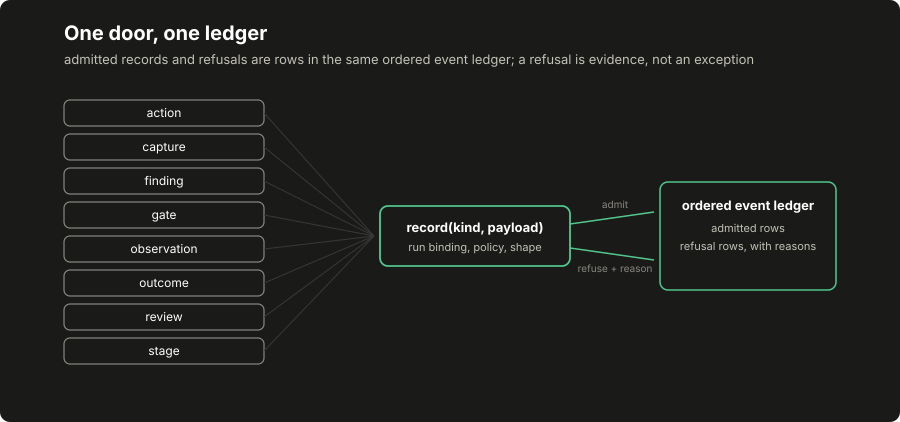

# Lesson 2: policy, records and the write boundary

Lesson 1 read a finished report. This lesson builds three parts of its recording path: operator policy stored outside model input, records with checkable identities, and one validated interface for state changes and refusals. The resulting ledger shows what the run admitted and declined.

## Build this

`core/run/records.py` (the record vocabulary and its digests), `core/run/policy.py` (authorization, tools and budgets as data, answering with decision records), and `core/run/recorder.py` (the single door). Plus the lesson's committed demo artifact showing an admitted chain and five recorded refusals side by side.

## Start from here

[Lesson 1](01-first-run.md) complete: a clean clone, the fixture report reproduced, and the suite green.

## Inputs and outputs

A policy is plain data an operator can review:

```json
{"reference": "training-authorization-0001",
 "allowed_origins": ["https://lab.example:443"],
 "tools": [{"tool_id": "inspect_headers", "activity": "passive",
            "requires": {}, "family": "fam-recon", "weight": 2.0, "cost": 1.0}],
 "max_actions": 4, "max_model_calls": 4}
```

Every question asked of it comes back as a decision record, not a bare boolean:

```json
{"allowed": false,
 "reason": "destination https://other.example:443 is outside the explicit authorized origins"}
```

The reason goes into the ledger when work is turned away. The action identity is one normalized string carrying the tool and canonical destination. A capture's identifier is a content hash bound to its run: the same content gives the same identifier, and changing the content changes that identifier. The host can detect a changed capture when it checks a finding's reference. The hash does not authenticate the author or prevent replacement of both the content and its hash.

## Implement it

1. **Write the vocabulary.** In `core/run/records.py`, define [`run/records.py:Run`](../../core/run/records.py), [`run/records.py:Action`](../../core/run/records.py), [`run/records.py:Capture`](../../core/run/records.py), [`run/records.py:Finding`](../../core/run/records.py) and [`run/records.py:ReviewDecision`](../../core/run/records.py) as frozen dataclasses whose validation raises a typed error. [`run/records.py:action_identity`](../../core/run/records.py) builds the one action string every later lesson shares: proposal, selection, execution, recording and feedback all name an act by it, so an empty destination is a loud error at construction instead of an empty key earning credit downstream.

2. **Make identity content-addressed.** [`run/records.py:make_capture`](../../core/run/records.py) computes the capture identifier as a digest over run, action, status and body together, and the `Capture` record refuses an identifier that is not the digest of its own content. [`run/records.py:make_run`](../../core/run/records.py) does the same for the run itself: its identity is a digest over the policy snapshot and the world inputs, which is why lesson 1's fixture edit changed the run identifier.

3. **Declare the policy.** In `core/run/policy.py`, [`run/policy.py:Policy`](../../core/run/policy.py) holds the authorization reference, the canonicalized origin list, the tool catalogue and the budgets, and answers through [`run/policy.py:allows_destination`](../../core/run/policy.py), [`run/policy.py:knows_tool`](../../core/run/policy.py) and [`run/policy.py:allows_action`](../../core/run/policy.py). Nothing a model writes is a policy input. The `origin` canonicalizer is a deliberate twin of the fixture lab's: the import gate keeps `core/` standard-library-only, so the function is restated and an equivalence test in `tests/test_run_policy_equivalence.py` holds the twins together. The policy's origin twin agrees with the fixture lab's canonicalizer across the shared case table.

4. **Build the door.** In `core/run/recorder.py`, [`run/recorder.py:Recorder`](../../core/run/recorder.py) owns every piece of mutable run state, and `record(kind, payload)` is the only way in. The door validates the run binding first, then the kind's own contract: an action payload is asked of the policy, a capture is content-addressed on arrival, a finding has to cite a capture the run holds and quote it verbatim. Refusals go through [`run/recorder.py:refuse`](../../core/run/recorder.py) into the same ordered ledger as admitted work, so the run's story includes what it declined.

5. **Run the demo.** [`run/demo_records.py:run_demo`](../../core/run/demo_records.py) drives one admitted chain (observation, action, capture, outcome, finding, review) and then five operations the door turns away, writing both into one artifact.

## Run it

```bash
python3 -m pytest tests/test_run_records.py tests/test_run_policy_equivalence.py -q
python3 -m core.run.demo_records --out /tmp/records-demo.json
diff -u data/course/records-demo.json /tmp/records-demo.json
```

The `diff` prints nothing; the committed artifact is byte-identical to your run.

## Inspect it

[](../../docs/assets/course/write-boundary.svg)

Open `/tmp/records-demo.json`. The `admitted` list is the happy chain, each entry carrying the identifier the next one binds to: the action's `action_id` appears in the capture, the capture's `capture_id` in the finding, the finding's `finding_id` in the review. The `refused` list carries five decisions, each with `recorded: false` and a reason. The `report` at the bottom is the recorder's snapshot: the same refusals appear as `refused` events in `events`, in order, between the admitted writes: one ledger, both kinds of story. Two of its fields stay empty this early and belong to later lessons: `stage` is the stage machine's business in lesson 3, and `closed` stays null until lesson 9's finish or abort seals the run. Note what the stores show: no capture and no outcome exists for any refused operation, because a refusal happens before anything changes.

## Break it

Attack the door directly and read its answers:

```bash
python3 - <<'PY'
from core.run.demo_records import build_policy
from core.run.recorder import Recorder
from core.run.records import make_run

policy = build_policy()
run = make_run(policy.snapshot(), {"world": "break-it"})
recorder = Recorder(run, policy)

for kind, payload in [
    ("action", {"run_id": run.run_id, "tool": "inspect_headers",
                "destination": "https://other.example/", "arguments": {}}),
    ("action", {"run_id": run.run_id, "tool": "shell",
                "destination": "https://lab.example/", "arguments": {}}),
    ("capture", {"run_id": "another-run", "action_id": "probe -> x",
                 "status": 200, "body": "hello"}),
    ("outcome", {"run_id": run.run_id}),
]:
    print(recorder.record(kind, payload))

report = recorder.snapshot()
print({"captures": len(report["captures"]), "outcomes": len(report["outcomes"]),
       "refusals": report["counts"]["refusals"]})
PY
```

Expected output:

```text
{'recorded': False, 'reason': 'destination https://other.example:443 is outside the explicit authorized origins'}
{'recorded': False, 'reason': "tool 'shell' is not declared in the catalogue"}
{'recorded': False, 'reason': 'payload run_id does not belong to this run'}
{'recorded': False, 'reason': "malformed payload: KeyError('action_id')"}
{'captures': 0, 'outcomes': 0, 'refusals': 4}
```

Four attacks, four recorded reasons, zero side effects. Separately, the fifth refusal in the committed demo is the one worth memorizing: a finding with a fabricated quotation (text that does not occur in the cited capture) is turned away at the door, which is citation integrity enforced mechanically. The converse discipline matters just as much and is not this door's job: a quote that does occur proves nothing about exploitability, and the verification lesson takes that up properly.

## Build it yourself

The reference implementation above is the worked solution; this is your edit. Open `starter/lesson02.py` (it is yours, outside the reference package) and build `build_my_policy()` to the contract in its docstring: your own authorization reference, the one lab origin, the reference `inspect_headers` tool, and a new fictional `inspect_metadata` tool that requires the observed field `has_meta`. Then run your completion check:

```bash
python3 -m pytest starter/lesson02_test.py -q
```

The starter's completion test fails on a fresh clone and passes only after your edit. Before you edit, run it once and read the failure. It names exactly what is missing. Predict, before your second run: which of the paired tests will your policy pass first, and what will the door say about `inspect_metadata` aimed at `https://other.example/about`? The worked answer is `starter/solutions/lesson02.py`, for after your attempt; the fictional tool you just declared continues through the lesson 4 and lesson 5 starters.

## Check completion

- The action identity is one normalized string carrying the tool and the canonical destination.
- A capture is content-addressed: its identity is a digest of its own bytes bound to its run.
- An undeclared tool and an unauthorized destination each produce a refusal event naming the reason.
- A rejected operation leaves no adapter side effect and carries a recorded reason in the same ledger as the work that was admitted.
- An operation naming another run's identity is turned away before any store changes.
- A malformed payload is recorded as a refusal rather than raising out of the boundary.
- A finding whose quote does not occur verbatim in its cited capture is turned away at the write boundary. A finding cites a capture the run actually holds.
- A second terminal outcome for the same action is turned away. An unresolved outcome may later be settled, and a settled one may not.
- A capture or outcome naming an action this run never authorized is refused at the door.
- One act has one identity: alias spellings of a destination collapse at the door before anything is recorded.

Each sentence is a named test in `tests/test_run_records.py` or `tests/test_run_policy_equivalence.py`; completion is those suites green plus the byte-identical `diff` above.

## Continue

[Lesson 3](03-stages-and-observations.md) puts an operational stage machine over this boundary. One scope statement to carry forward, the same one the fixture lab makes: this is an application boundary: the host process and adapters are trusted here, and containing a hostile adapter needs process and transport isolation that no in-process door provides.
