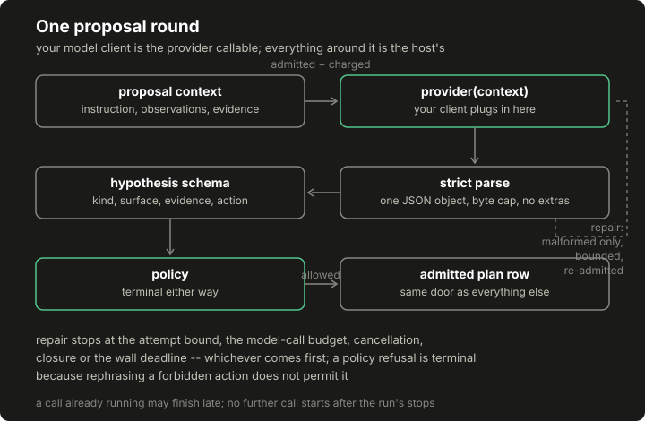

# Lesson 4: a model that proposes useful work

The fixture bridge from lesson 1 asked a model to echo the host's own next action: a connection test, deliberately empty of judgment. This lesson gives the model something real to say: a hypothesis, bound to observed surfaces and evidence, requesting an action the host then judges. The division of labor is the whole design: the provider wrapper parses and repairs, the schema names what a proposal is, and the policy alone decides what runs. Everything the model touches is advice.

## Build this

`core/run/proposals.py`: strict parsing with the fixture bridge's discipline, the hypothesis proposal schema, bounded repair, terminal policy refusals, provider error, timeout and cancellation statuses, and usage accounting. Plus the committed demo artifact with an admitted hypothesis, a repaired one, an exhausted session and a hostile-text refusal.

## Start from here

[Lesson 3](03-stages-and-observations.md) complete: observations exist as records, and the write boundary is in place.

## Inputs and outputs

A proposal is one JSON object with exactly these keys and no others:

```json
{"kind": "form-input-handling",
 "surface": "login_has_form",
 "evidence": ["login_status", "login_has_form"],
 "action": {"tool": "form_probe",
            "destination": "https://lab.example/login",
            "arguments": {"field": "username"}}}
```

`kind` names the hypothesis family. `surface` and `evidence` bind it to recorded observations by name: a hypothesis about nothing the run observed is malformed, not merely weak. `action` is the request, and the session's answer is a report either way: admitted with the normalized action identity, or not admitted with a status naming exactly why: `malformed`, `refused_by_policy`, `repair_exhausted`, `provider_error`, `timeout`, `cancelled`, `model_call_budget_exhausted` or `admission_refused`, the last carrying the host's own stop reason.

## Implement it

1. **Parse strictly.** [`run/proposals.py:parse_strict`](../../core/run/proposals.py) restates the fixture bridge's discipline (a byte cap before parsing, duplicate JSON keys refused, nonstandard constants refused, an object or nothing) because the cheapest place to stop nonsense is before it becomes structure. A reply above the byte limit is malformed before it is parsed.

2. **Validate the shape.** [`run/proposals.py:validate_shape`](../../core/run/proposals.py) holds the proposal to its exact key set and binds it to the run's records. Unknown fields are turned away by the schema before policy is even consulted. Evidence references have to name recorded observations.

3. **Bound the repair.** [`run/proposals.py:ProviderSession`](../../core/run/proposals.py) gives the provider another attempt when a reply is malformed, carrying the validation error back as context, up to a small fixed budget. A malformed reply is repairable within the attempt budget; a policy refusal is terminal. The distinction is the lesson: a reply the parser could not use might improve with feedback, but a well-formed request for something forbidden is a policy answer, and rephrasing a forbidden action does not make it permitted. Repair exhaustion ends the session with a report, not an admitted action.

4. **Wrap the provider honestly.** A provider is a callable and an outside process: exceptions come back as `provider_error`, elapsed time past the deadline as `timeout`, and a cancellation callable stops the session between attempts. A provider exception, a timeout and a cancellation each end with their own status. The timeout is cooperative (read after the call returns) which surfaces a slow provider without interrupting it; real interruption needs process machinery outside this teaching module. The session accounts for calls and bytes either way. The model-call budget bounds a session across attempts. A host with wider stops (a wall clock, a closed run) hands the session an `admission` callable, and the rule it buys is exact. The host's admission check is consulted before every call, repairs included: a call already running may finish past the run's stops, and no further call starts after them.

5. **Swap providers, not permissions.** [`run/proposals.py:FakeProvider`](../../core/run/proposals.py) replays authored replies for tests and demos; your real client is any callable with the same one-argument shape. Two contracts exist and must not be confused: [the model connection guide](../../docs/CONNECT_YOUR_MODEL.md)'s bridge speaks the fixture lab's older action format and stays a connection smoke test, while this lesson's hypothesis contract is what the assembled application expects, and `examples/app_agent.py` is the executable wrapper that builds this exact schema and tool vocabulary around one transport, fake by default, your local model by flag. The guide carries the field-by-field migration table between the two. Changing the model wrapper does not change scope or execution permissions.

## Run it

```bash
python3 -m pytest tests/test_run_proposals.py -q
python3 -m core.run.demo_proposals --out /tmp/proposals-demo.json
diff -u data/course/proposals-demo.json /tmp/proposals-demo.json
```

## Inspect it

[](../../docs/assets/course/proposal-sequence.svg)

Open `/tmp/proposals-demo.json`. Four sessions against the same policy and observations. `admitted_first_try` carries the admitted proposal and the normalized `action_id` the rest of the pipeline will use. `repaired_on_second_attempt` shows the attempts list (`malformed`, then `admitted`) with the validation error that made the second attempt better. `repair_exhausted` is the bounded failure: a report, an attempts list, usage totals, and no action. `hostile_retrieved_text` is the one to read twice: the context contains retrieved text instructing the model to use an unapproved tool against an out-of-scope host, the fake provider obeys it, and the report says `refused_by_policy` with the tool refusal as its reason. Injected instructions in retrieved text can change what the model asks for, and cannot change what is permitted.

## Break it

Steer a well-formed proposal at a forbidden destination and watch which rule answers:

```bash
python3 - <<'PY'
import json
from core.run.demo_proposals import CONTEXT, OBSERVATIONS, VALID
from core.run.demo_records import build_policy
from core.run.proposals import FakeProvider, ProviderSession

forbidden = json.loads(VALID)
forbidden["action"]["destination"] = "https://other.example/"
session = ProviderSession(FakeProvider([json.dumps(forbidden), VALID]))
report = session.propose(CONTEXT, observations=OBSERVATIONS,
                         policy=build_policy())
print(report["status"])
print(report["reason"])
print([a["status"] for a in report["attempts"]])
print(report["usage"])
PY
```

Expected output:

```text
refused_by_policy
destination https://other.example:443 is outside the explicit authorized origins
['refused_by_policy']
{'calls': 1, 'request_bytes': 255, 'reply_bytes': 219}
```

The provider held a perfectly valid second reply, and the session did not go back for it: one policy answer ended the session, with the usage ledger showing exactly one call. Compare that with the committed demo's repair case, where a malformed reply earned a second attempt: the two failure kinds get opposite treatment on purpose.

## Build it yourself

Your lesson 2 policy declares `inspect_metadata`; now write the provider that proposes it. Open `starter/lesson04.py` and build `my_provider(context)` to its docstring's contract: JSON text for one hypothesis: kind, an observed surface, evidence naming only recorded observations, and the action your policy authorizes. Then:

```bash
python3 -m pytest starter/lesson04_test.py -q
```

The starter's completion test fails on a fresh clone and passes only after your edit. Predict before running: if your `evidence` list names a field the run never observed, which layer refuses (the parser, the schema, or the policy) and with what status? (Check your prediction against the session report's `attempts`.) The worked answer is `starter/solutions/lesson04.py`.

## Check completion

- A reply whose text cannot even be encoded is a malformed attempt with a repair round, not a provider failure.

- A malformed reply is repairable within the attempt budget; a policy refusal is terminal. Repair exhaustion ends the session with a report, not an admitted action.
- Unknown fields are turned away by the schema before policy is even consulted. Evidence references have to name recorded observations. A reply above the byte limit is malformed before it is parsed.
- Injected instructions in retrieved text can change what the model asks for, and cannot change what is permitted. Changing the model wrapper does not change scope or execution permissions.
- A provider exception, a timeout and a cancellation each end with their own status. The session accounts for calls and bytes either way. The model-call budget bounds a session across attempts.
- The host's admission check is consulted before every call, repairs included: a call already running may finish past the run's stops, and no further call starts after them.
- A well-formed reply carrying the wrong types inside is one more malformed attempt, never a crash.

Each sentence is a named test in `tests/test_run_proposals.py` or `tests/test_run_control_enforcement.py`; completion is those suites green plus the byte-identical `diff` above. Scope the injection claim to what the tests actually exercise: an instruction in retrieved context steering the proposal toward an undeclared tool or an unauthorized destination. That is the attack class covered here: proposals that need permissions the policy withholds. It is not general prompt-injection immunity: hostile text can still waste attempts, skew which authorized action gets proposed, or poison the hypothesis text itself, and the context and verification lessons take those up.

## Continue

[Lesson 5](05-candidates-and-dispatch.md) turns admitted work into an eligible candidate set, ranks it, and executes it through the same recorder. Expect one marked detour on the way in: lesson 5 opens by sending you to [lesson 10](10-controller-laboratory.md) for the small selection contract dispatch speaks (its top through step seven: the records, the feedback definition, the two baselines and the factory), and a bold return line there sends you straight back. It is a short read, and none of the adaptive machinery behind it is required.
