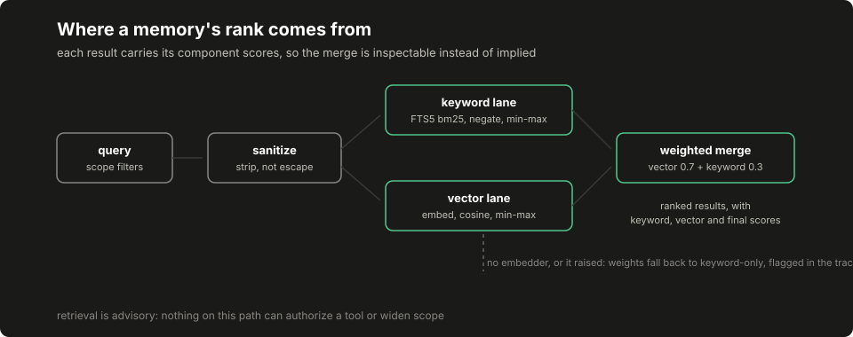

# Lesson 6: retrieval and persistent memory

An agent that forgets everything between runs re-derives the same conclusions at full price, and an agent that recalls the wrong things leaks one engagement's details into another. This lesson builds a memory whose recall you can inspect independently of any model answer: records with provenance and scope, a full-text index, a hybrid search whose component scores print, deterministic retrieval lanes with sample sizes attached, and the two correction paths (refutation and deletion) that make remembered claims retractable. Retrieval-augmented generation, the pattern where relevant records are retrieved and placed before a model generates, is only trustworthy when the retrieval half stands on its own; that half is this lesson.

## Build this

`core/memory/`: the record vocabulary in `records.py`, the SQLite store and its writers in `store.py`, hybrid search in `search.py`, and the structured lanes in `lanes.py`. At the end you can ingest a fictional corpus, run a query, read exactly why each result ranked where it did, refute a learned tactic and watch it stop surfacing.

## Start from here

[Lesson 5](05-candidates-and-dispatch.md) complete, with the suite green. This lesson depends on [lesson 1](01-first-run.md)'s fixture-lab familiarity and on nothing model-facing, and on nothing from the controller track; the store and search run entirely offline.

## Inputs and outputs

The committed corpus at `data/course/memory-corpus.json` is entirely fictional: invented stack fingerprints, invented engagements, hosts that only exist under `.example`. One long-term tactic record, as stored:

```json
{"tier": "longterm", "record_type": "tactic",
 "content": "union-based sql injection on the items api id parameter",
 "profile_hash": "python:postgresql:waf_present:generic_waf:rest:flask",
 "engagement": "engagement-a", "tool_name": "test_sqli",
 "url_pattern": "/api/*/items",
 "metadata": {"signature": "9c41…", "param_name": "id",
              "bypass_technique": "union_select",
              "total_attempts": 4, "total_successes": 3,
              "success_rate": 0.75, "evidence_grade": "proven",
              "targets_seen": ["1f2d8a3c"], "refuted": false}}
```

The scope fields carry the design. `profile_hash` is a colon-joined stack fingerprint, so tactics generalize by stack, not by host. `engagement` scopes host-bound records to one engagement. And `targets_seen` holds hashes: target domains are stored only as short one-way hashes, in tactics that travel across engagements. A search answers with a `SearchResult` carrying `keyword_score`, `vector_score` and the merged `score`, plus a trace of the raw and normalized lanes, and the stored row's own `created_at` and `expires_at`, so a consumer can honor the record's expiry instead of restarting its clock at retrieval time; lesson 16's assembled application does exactly that.

## Implement it

1. **Write the record vocabulary.** In `core/memory/records.py`, define [`memory/records.py:MemoryRecord`](../../core/memory/records.py) with the tier field over [`memory/records.py:TIERS`](../../core/memory/records.py): working memory is the run's scratch state, episodic is what happened run by run, long-term is distilled tactics, knowledge is authored reference. The tiers differ in lifetime and consumer, and all four tiers share one storage shape, so provenance, scope and retention are uniform rather than per-tier afterthoughts. Add [`memory/records.py:normalize_endpoint`](../../core/memory/records.py) (volatile path segments become `*`), [`memory/records.py:tactic_signature`](../../core/memory/records.py) (the dedup key) and [`memory/records.py:anonymize_target`](../../core/memory/records.py).

2. **Build the store and its three writers.** In `core/memory/store.py`, create the records table and the FTS5 external-content index kept in sync by triggers: the same pattern the originating implementation uses. When the interpreter's SQLite lacks FTS5 the store refuses to start rather than index nothing. The writers have deliberately different powers. [`memory/store.py:MemoryStore`](../../core/memory/store.py)'s `record_success` is the only creator: a repeated success lands on the existing tactic row as an increment, not a duplicate. A recorded failure updates an existing tactic's counters and creates nothing. `record_refuted` is the correction path the originating implementation also has: a refutation is an in-place flag: the row stays, the grade returns to hypothesis, the confidence drops, and default reads exclude it. It is a correction flag, not a tombstone or a supersede chain. Deletion is a separate operation that removes the row and its index entry outright.

3. **Grade evidence, upward only.** A tactic stored with proof text is graded `proven`; without, `hypothesis`. The evidence grade only moves up on new proof, and only a refutation moves it back down. Hypotheses are useful ordering signals and nothing more; the rendering in the lanes marks them so a reader re-verifies before trusting one.

4. **Scope every read.** `fetch` takes filters only from [`memory/store.py:FILTER_ALLOWLIST`](../../core/memory/store.py), with key names interpolated only after membership and values always parameterized. An unknown scope filter is refused loudly instead of being ignored, because a silently dropped filter is an isolation hole wearing a convenience.

5. **Build the hybrid search.** First calculate one ranking by hand. Suppose keyword hits score 2.0, 1.0 and 0.5. Min-max normalization uses `(score - min) / (max - min)`, giving 1.0, 0.333 and 0.0. Cosine similarity is the dot product of two vectors divided by their lengths; parallel vectors score 1.0 and orthogonal vectors score 0.0. Normalize the vector hits separately. A record scoring 1.0 on keywords and 0.5 on vectors merges to 0.3 * 1.0 + 0.7 * 0.5 under the default weights. [^num-1]

   In `core/memory/search.py`, the keyword lane uses FTS5's BM25, negated and normalized over its candidate pool; a candidate pool with no internal ordering maps every member to the same normalized score. The vector lane uses stored float lists and an injected embedding function. The weighted merge records 0.7 for vectors and 0.3 for keywords by default. With no embedder configured, or an embedder that raises, the weights become zero and one and the trace says so.

   Query sanitization strips operator characters to spaces, so quoted phrases are impossible by design. A search filter outside the scope-key allowlist is refused. A refuted record stops surfacing in search as well as in the lanes.

   One fidelity note, of the kind [the evidence register](../appendix-f-evidence-register.md) keeps for studies: in the originating implementation, no embedding function is wired on any production path, so its hybrid engine always takes the keyword-only branch. The vector lane exists there, unwired and unexercised; nothing runs it, in production or in its tests. Implementation availability and operating configuration are different facts, and this lesson teaches both lanes while saying which one the original actually runs.

One preflight worth a moment: `python3 -c "import sqlite3; c=sqlite3.connect(':memory:'); c.execute('CREATE VIRTUAL TABLE t USING fts5(x)'); print('fts5 ok')"`. If that prints an error instead of `fts5 ok`, your Python's SQLite lacks the FTS5 extension the keyword lane needs (the store refuses to start rather than index nothing) and the fix is a Python build with standard SQLite (python.org installers and Debian/Fedora/Homebrew packages all qualify; some minimal containers do not).

6. **Build the structured lanes.** In `core/memory/lanes.py`, retrieval a planner can audit: plain SQL, no embeddings. Profile priors aggregate per-tool statistics across similar profiles; [`memory/lanes.py:profile_similarity`](../../core/memory/lanes.py) compares fingerprint components position by position; components where either side is unknown are skipped, and a nearly-empty fingerprint cannot match at full confidence, and the ranking confidence is the Wilson lower bound over the raw pooled counts. Priors order work and are not plan entries; a tool deprioritized on its own silence must still be able to correct the record. Host history is scoped to one engagement. Learned tactics come capped per tool: proven tactics rank before hypotheses, and refuted tactics are excluded. Negative evidence renders with denominators: a zero-hit row appears in the negative-evidence section only when its denominator is big enough to mean something.

7. **Work the Wilson arithmetic by hand.** The lower bound of the Wilson score interval, for hits `h` out of `n` at `z = 1.96`:

   ```text
   phat   = h / n
   denom  = 1 + z^2 / n
   centre = phat + z^2 / (2n)
   margin = z * sqrt(phat*(1 - phat)/n + z^2/(4 n^2))
   LB     = max(0, (centre - margin) / denom)

   h=1,  n=1  : phat = 1.000 -> LB = 0.2065
   h=12, n=23 : phat = 0.522 -> LB = 0.3296
   ```

   The raw ratio puts the single lucky try first; the bound puts the evidenced tool first. The Wilson lower bound ranks `1/1` below `12/23`, which is the point of using it. The committed demo records both values, 0.206543 and 0.329624, and `tests/test_memory_lanes.py` recomputes them beside this fence.

## Run it

```bash
python3 -m pytest tests/test_memory_store.py tests/test_memory_search.py tests/test_memory_lanes.py -q
python3 -m core.memory.demo_memory --out /tmp/memory-demo.json
diff -u data/course/memory-demo.json /tmp/memory-demo.json
```

The `diff` prints nothing: the demo ingests the committed corpus with fixed timestamps and a deterministic fake embedder, so the artifact is byte-stable.

## Inspect it

[](../../docs/assets/course/retrieval-pipeline.svg)

Open `/tmp/memory-demo.json` and read it section by section. `dedup` shows the long-term row count unchanged after replaying a success. `hybrid.trace` holds each lane's raw and normalized scores beside the weights, so any final score recomputes by hand; `keyword_only.trace` shows the same query under fallback, flagged with its reason. `lanes.profile_priors` carries the Wilson ordering: the top tool is `test_sqli` at confidence 0.272354, and the tool with a perfect single try ranks below it. `lanes.negative_evidence` names the dry tool with its 8-try denominator and says deprioritize, not skip. `lanes.host_history` contains only the demo engagement's findings, with the cross-engagement finding, the false positive, the informational row and the current run all absent. `refutation` and `deletion` each show the tactics list before and after: the refuted tactic vanishes from default reads while its row survives for audit, and the deleted one is simply gone.

## Break it

Isolation and correction, attacked directly:

```bash
python3 - <<'PY'
from core.memory.lanes import host_history, learned_tactics
from core.memory.store import MemoryStore, MemoryStoreError

store = MemoryStore()
store.record_finding(finding_id="f-b", run_id="run-9",
                     engagement="engagement-b", severity="critical",
                     title="SSRF", url="https://b.example/hooks", type="ssrf")
print(host_history(store, "engagement-a"))

try:
    store.fetch(hostname="b.example")
except MemoryStoreError as exc:
    print(type(exc).__name__, str(exc).partition(" (")[0])

keys = dict(profile_hash="python:x:y", tool="test_idor",
            endpoint="/api/9/orders", param="order_id")
store.record_success(**keys)
print([t["tool"] for t in learned_tactics(store, "python:x:y")])
store.record_refuted(**keys)
print([t["tool"] for t in learned_tactics(store, "python:x:y")])
PY
```

Expected output: the foreign engagement yields nothing, the unlisted filter is an error rather than a shrug, and the refutation empties the lane:

```text
[]
MemoryStoreError filter 'hostname' is not in the scope-key allowlist
['test_idor']
[]
```

## Check completion

- A search never inherits an earlier search's lane-error flag.

- A repeated success lands on the existing tactic row as an increment, not a duplicate, and a recorded failure updates an existing tactic's counters and creates nothing.
- Another engagement's findings never surface in host history, and the current run, false positives and informational findings stay out of host history.
- Every result carries its component scores, and the final score recomputes from them and the recorded weights.
- Refuting a tactic removes it from the lanes and from search while its row survives for audit; deleting removes the row outright.
- Components where either side is unknown are skipped, and a nearly-empty fingerprint cannot match at full confidence.
- The lanes' output is advisory data with provenance references; nothing retrieved here can authorize a tool, change a budget or expand a scope, because no authorization surface reads from this package.
- The sanitizer lowercases the query, so FTS5's bare-word operators become ordinary search words.
- A failed keyword lane is flagged in the trace as `keyword_lane_error`, distinct from a lane that simply matched nothing.
- A refuted tactic declines new successes loudly instead of silently rehabilitating.

Each behavioral sentence above is pinned by a named test across `tests/test_memory_store.py`, `tests/test_memory_search.py` and `tests/test_memory_lanes.py`; completion is those suites green plus the byte-identical `diff`.

## Continue

[Lesson 7](07-context-assembly.md) turns retrieved material into the exact context a provider sees, with a record of what was left out. Deliberate simplifications to carry forward: this store is a single synchronous SQLite file with no pruning or migration machinery, the fake embedder preserves vocabulary and nothing else, and the corpus is small enough to read whole: the mechanisms, not the scale, are the lesson.

---

## Number annotations

These notes were written inline in the handbook source beside the numbers they explain; each renders as a footnote at its point of use above.

[^num-1]: the retrieval walk-through's numbers (0, 1, 2.0, 1.0, 0.5, 0.333, 0.0) are invented arithmetic-example values, not measurements
