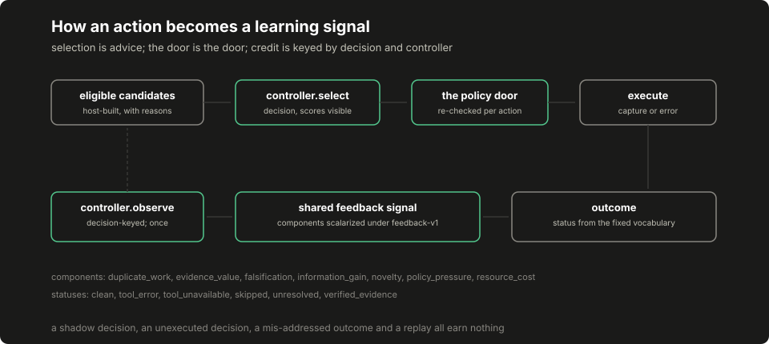
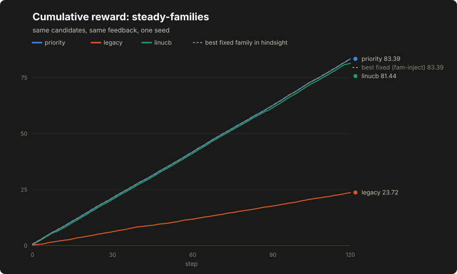

# Lesson 10: the controller laboratory

A controller answers one question: of the work the host has already authorized, what runs next? Everything else (what is eligible, what is permitted, what gets executed, what gets recorded) stays with the host. This lesson builds the laboratory that makes selection policies comparable: the records they exchange, the feedback they learn from, two deterministic baselines, and a runner that puts any policy through the same synthetic world under the same rules. The adaptive algorithms in the next lessons plug into this contract without touching anything outside it.

Two audiences read this page. Core-route builders arriving from [lesson 5](05-candidates-and-dispatch.md): read from here down to the bold core-route return line at the end of step seven; that is your whole detour, and nothing past that line is required for the assembled application. Controller investigators: read the whole page; this laboratory is your route's foundation.

## Build this

Four record types and one base class in `core/controller/contract.py`, a shared feedback definition in `core/controller/feedback.py`, two baselines in `core/controller/baselines.py`, a factory in `core/controller/__init__.py`, and a comparison runner with named synthetic worlds in `core/controller/lab.py` and `core/controller/worlds.py`. At the end you can run three controllers through the same world and read, per step, what each saw, what it chose, and what reward that choice earned.

## Start from here

A clean clone with [the fixture lab](../07-harness-lab.md) already run once and the suite green:

```bash
python3 -m harness.demo --out /tmp/harness-report.json
python3 -m pytest tests/ -q
```

This lesson and the next are the controller track's opening pair; they depend on the fixture lab and on nothing else in the course.

## Inputs and outputs

A controller consumes a state and a candidate list, and answers with a decision. The host later reports an outcome. All four are plain records:

```json
{"run_id": "run-a", "step": 3,
 "features": {"bias": 1.0, "stage_progress": 0.4, "surface_known": 1.0,
              "recent_error_rate": 0.0, "budget_remaining": 0.6},
 "schema_version": "features-v1"}
```

```json
{"candidate_id": "sqli-probe:login-form", "family": "fam-inject",
 "priority": 3.0, "novelty": 0.2, "cost": 3.0}
```

```json
{"decision_id": "f3ac91d24be07c11", "candidate_id": "sqli-probe:login-form",
 "family": "fam-inject", "scores": {"rule": "priority", "by_candidate": {}},
 "selected_features": [1.0, 0.4, 1.0, 0.0, 0.6], "shadow": false,
 "controller": "priority", "schema_version": "features-v1"}
```

```json
{"decision_id": "f3ac91d24be07c11", "candidate_id": "sqli-probe:login-form",
 "run_id": "run-a", "status": "clean", "feedback": 0.45, "executed": true}
```

Two identities do the load-bearing work. The `candidate_id` is the one normalized action identity the whole pipeline shares: proposal, selection, execution, recording and feedback all name an action by this string, so an outcome is attributed to the action that ran and to nothing else. How far a plastic controller then spreads that credit across its own live traces is a mechanism [lesson 13](13-plasticity-and-credit.md) states rather than hides. The `decision_id` names one act of choosing, and feedback is keyed by it.

The outcome's `status` comes from a fixed vocabulary: `clean`, `tool_error`, `tool_unavailable`, `skipped`, `unresolved`, `verified_evidence`, because an errored tool, a tool the host does not have, a clean result, skipped work, an execution whose record was lost, and a result that produced verified evidence are different facts, and a controller fed a vocabulary that collapses them learns from mush.

## Implement it

1. **Define the records.** In `core/controller/contract.py`, write [`controller/contract.py:State`](../../core/controller/contract.py), [`controller/contract.py:Candidate`](../../core/controller/contract.py), [`controller/contract.py:Decision`](../../core/controller/contract.py) and [`controller/contract.py:Outcome`](../../core/controller/contract.py) as frozen dataclasses. Give `State` a `vector()` method that reads the ordered feature names from [`controller/contract.py:FEATURE_SCHEMA`](../../core/controller/contract.py) under the record's `schema_version` and refuses missing or non-finite values. The order of names is part of the schema version: controllers read the vector positionally, so reordering is a new version, not an edit.

2. **Make ties boring.** Write [`controller/contract.py:stable_best`](../../core/controller/contract.py): highest score wins, ties go to the smallest explicit tiebreak key. Selection has to replay (the same items and scores produce the same choice regardless of input order) and an implicit "whatever came first in the list" is where replay quietly dies.

3. **Write the base class.** [`controller/contract.py:Controller`](../../core/controller/contract.py) implements `select`, `observe`, `reset`, `snapshot` and `restore` once; a policy only fills in `_choose` and `_learn`. On a non-shadow selection, `select` files a pending record under the new `decision_id`; `observe` pops the pending record the outcome names and refuses everything else: an unknown decision, an unexecuted one, or an outcome naming a different candidate than the decision chose.

4. **Know what you corrected.** Keying pending feedback by decision identifier is a deliberate teaching correction, not a transcription: the system this course generalizes from kept a single sequential pending selection, which a second selection could overwrite before its outcome arrived. The decision-keyed design keeps interleaved feedback attributable; the original contract is recorded in [the evidence register](../appendix-f-evidence-register.md)'s controller cards and in this lesson so the two are never presented as the same implementation.

5. **Define feedback once.** In `core/controller/feedback.py`, write [`controller/feedback.py:assemble_signal`](../../core/controller/feedback.py) and [`controller/feedback.py:scalarize`](../../core/controller/feedback.py). The signal's named components (evidence value, information gain, novelty, falsification, duplicate work, resource cost, policy pressure) are combined under the versioned weights in [`controller/feedback.py:WEIGHTS`](../../core/controller/feedback.py), and every controller in every comparison learns from this one definition. An evidence grade here measures what the record supports, not ground-truth security value.

6. **Write the baselines.** In `core/controller/baselines.py`, [`controller/baselines.py:PriorityController`](../../core/controller/baselines.py) takes the highest host-assigned priority and [`controller/baselines.py:LegacyRankingController`](../../core/controller/baselines.py) takes priority per unit cost, the same shape as the fixture lab's `weight / cost` planner. Both are stateless; they are the floor an adaptive policy has to beat before its machinery earns anything.

7. **Build the factory.** [`controller/__init__.py:make_controller`](../../core/controller/__init__.py) constructs a controller by name with learning off unless the caller passes `learn=True` explicitly. Ordinary configuration never turns learning on; research code does it on purpose, in writing. Local controller learning updates this package's own small weight tables and does not fine-tune any language model.

    **Core-route return point.** If lesson 5 sent you here, this is where you turn back: the four records, the feedback definition, the two baselines and the factory above are everything dispatch and assembly need, and [lesson 5](05-candidates-and-dispatch.md) continues from its own page. The step below, and every controller lesson after this one, belong to the optional advanced route; the assembled application in [lesson 16](16-package-your-agent.md) needs none of them.

8. **Build the laboratory.** `core/controller/worlds.py` defines seeded synthetic worlds (each step yields the same features, the same candidates and the same reward table to every policy) and [`controller/lab.py:run_episode`](../../core/controller/lab.py) walks one controller through one world under the contract, while [`controller/lab.py:compare`](../../core/controller/lab.py) runs several and adds the hindsight baseline: the total reward of the best single family chosen after the fact.

## Run it

```bash
python3 -m pytest tests/test_controller_contract.py -q
python3 -m core.controller.lab --world steady-families --out /tmp/compare-steady.json
diff -u data/course/compare-steady-families.json /tmp/compare-steady.json
```

The test run prints its own pass count, the runner prints the output path, and the `diff` prints nothing: the committed artifact is byte-identical to a fresh run, the same discipline the fixture lab's report lives under.

## Inspect it

[](../../docs/assets/course/candidate-to-feedback.svg)

[](../../docs/assets/course/compare-steady-families.svg)

Open `/tmp/compare-steady.json`. Each controller carries a `trace` holding a row per step (`chosen_family`, `candidate_id`, `reward`, `cumulative_reward`, `learning_applied`) and a summary: `total_reward` and `regret_vs_best_fixed_family`, the gap to the best single family chosen with hindsight.

On this world the host's static priorities happen to be right, so the priority baseline is optimal: total 83.391417 against the hindsight baseline's 83.391417, regret 0.0. The cost-aware legacy ranking is wrong for the same world; total 23.715881, because the family it favors per unit cost pays little here. Neither policy learned anything; the whole difference is whether the host's static opinion happened to fit. Keep this chart in mind when the adaptive lessons start: a fixed rule that encodes a correct opinion is unbeatable on the world it fits, and the interesting question is what happens when the opinion is wrong or goes stale.

## Break it

Three refusals, at the boundary where learning credit is handed out. Run this from the repository root:

```bash
python3 - <<'PY'
from core.controller import make_controller
from core.controller.contract import Candidate, Outcome, State

state = State(run_id="r", step=0, features={"bias": 1.0, "signal": 0.0},
              schema_version="toy-v1")
candidates = [Candidate(candidate_id="a", family="f", priority=1.0),
              Candidate(candidate_id="b", family="f", priority=0.5)]
c = make_controller("linucb", learn=True)

shadow = c.select(state, candidates, shadow=True)
print(c.observe(Outcome(decision_id=shadow.decision_id, candidate_id="a",
                        run_id="r", status="clean", feedback=1.0)))

real = c.select(state, candidates)
print(c.observe(Outcome(decision_id=real.decision_id, candidate_id="b",
                        run_id="r", status="clean", feedback=1.0)))

ok = Outcome(decision_id=real.decision_id, candidate_id="a",
             run_id="r", status="clean", feedback=1.0)
print(c.observe(ok))
print(c.observe(ok))
PY
```

Expected output:

```text
{'applied': False, 'reason': 'unknown or shadow decision'}
{'applied': False, 'reason': 'outcome names a different candidate'}
{'applied': True, 'family': 'f', 'reward': 1.0}
{'applied': False, 'reason': 'unknown or shadow decision'}
```

The first refusal is the shadow rule: a recommendation the host never executed gets no learning credit, because crediting an action that did not run is the off-policy mistake the `executed` flag exists to name. The second is identity: the outcome names a different candidate than the decision chose, so nothing is applied. The third is the one legitimate application, and the fourth shows the same outcome bounced on replay; feedback applies once.

## Check completion

- Every controller selects from the same records: identical state, identical candidates, and a decision carrying the scores it used.
- Selection is stable under input order, and an empty candidate list yields no decision rather than an invented one.
- A shadow decision receives no learning credit, and neither does a decision whose outcome says it was not executed.
- An outcome naming a different candidate than its decision chose is refused with a recorded reason.
- A duplicate observation is not applied twice.
- A snapshot restores into a fresh instance of the same controller and is refused by any other.
- The decision identity includes the controller, so a comparison cannot misdeliver credit between controllers.
- The laboratory raises loudly, naming the controller, when a decision names a candidate the world never offered.

Each of those sentences is pinned by a named test in `tests/test_controller_contract.py`; the completion check is that suite passing, plus the byte-identical `diff` above.

## Choosing a controller

Which selection policy a build needs is an evidence question, not a sophistication ladder. The table is the whole guidance:

| Controller | Reach for it when | Evidence needed before adopting it | Runtime learning default |
|---|---|---|---|
| `priority` | Always first: the shipped default, and the floor everything else must beat | None. It is the baseline | None (stateless) |
| `legacy` | Declared costs matter and priorities alone misorder work | A comparison showing cost-awareness changes outcomes on your candidates | None (stateless) |
| `linucb` | Contextual feedback exists and you are investigating adaptation | The comparison protocol's frozen runs beating both baselines on your worlds | Frozen unless research code passes learn=True |
| `mb` | You are testing habituation against repeatedly unproductive surfaces | Habituation demonstrably suppressing the right surface class, nothing else | Frozen; habituation is episode state, not learning |
| `mb-plastic`, graph variants | Mechanism research | The register's bar: pre-registered comparisons, not demos | Research-only |

The most biologically elaborate option is not the most finished one; the evidence register records that the originating project's campaigns ended in ties and qualified toy results, not an adaptive victory.

## Continue

If you are on the core route, go back to [lesson 5](05-candidates-and-dispatch.md), or, having finished it, straight on toward [assembly](16-package-your-agent.md); the advanced route continues here. Next, [LinUCB step by step](11-linucb.md) builds the first adaptive policy on this contract. The deliberate simplifications to carry forward: the pending table lives in memory (a later lesson persists controller state across interruptions), and the worlds' rewards are abstract numbers for exercising selection. Nothing in this lesson measures security outcomes, and [the evidence register](../appendix-f-evidence-register.md) records what the originating project's live controller campaigns did and did not show.
