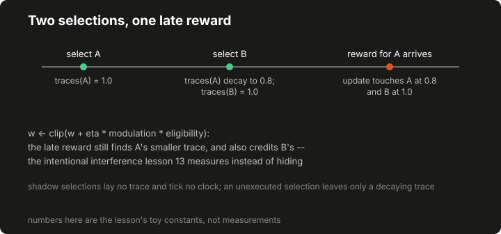
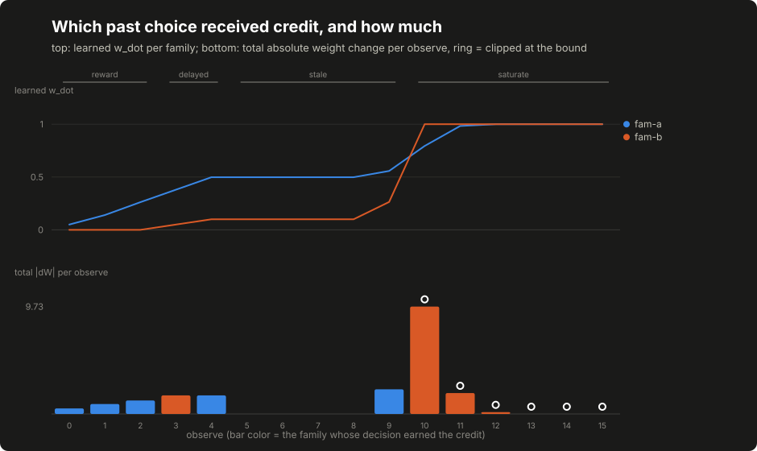

# Lesson 13: plasticity, delayed credit and cross-run priors

Lesson 12's controller reserves exactly one learning location: the weights from active expansion units to the family readout. This lesson switches that site on, as a separate research construction that the ordinary factory keeps frozen. The mechanism is three factors multiplied together (what was recently chosen (eligibility), how the outcome scored (modulation), and a small learning rate) with a hard clip so no weight runs away. Local controller plasticity adjusts this package's own weight table; it does not fine-tune any language model, and the sentence is worth repeating wherever the mechanism appears. One boundary to keep sharp from the start: this lesson's learning site is unit-to-family readout weights; the separate [experimental graph controller](14-graph-controller-experiments.md), later in the course, changes association-edge weights inside a graph, and the two must not be described as the same mechanism.

## Build this

`core/controller/plasticity.py`: eligibility traces, clipped local weight updates, a combined fixed-plus-learned readout, and the `mb-plastic` controller that stays behaviorally identical to `mb` until research code passes `learn=True`. Beside it, `core/controller/priors.py`: a versioned cross-run prior bank keyed by target profile, with the originating implementation's recorded key-format defect reproduced as an exercise and then corrected. Plus the committed update ledger the lesson reads.

## Start from here

[Lesson 12](12-mushroom-body-controller.md) complete, `tests/test_controller_mb.py` green.

## Inputs and outputs

The learning state is two sparse tables, both keyed by (expansion unit, family). Traces say what recent selections touched; weights say what accumulated credit believes:

```json
{"eligibility": {"37|fam-a": 1.8, "141|fam-a": 1.8, "37|fam-b": 1.0},
 "weights": {"37|fam-a": 0.14, "141|fam-a": 0.14}}
```

The update ledger the demo emits records, per observed outcome: the modulation, how many keys moved, how many hit the clipping bound, the total absolute change, and each family's learned readout at a probe code.

## Implement it

1. **Lay traces only for eligible selections.** [`controller/plasticity.py:Eligibility`](../../core/controller/plasticity.py) decays every trace on every learning-eligible select and adds one unit of eligibility to each active unit of the winning family. A shadow selection lays no eligibility trace: a later legitimate outcome cannot credit units only the shadow activated. The deposit therefore happens after the shadow flag is known, not inside the selection arithmetic (the same placement the graph controller uses) and a shadow recommendation neither deposits nor ages the live traces. A real selection the host then refuses is unwound exactly: the deposit's keys and its decay-pass date ride the contract's pending record, and when the refusal arrives the controller subtracts what remains of that deposit, so a later outcome cannot credit units only a refused selection activated. The rollback restores the refused deposit's share, not the world as it was, and its two edges are stated rather than hidden: the decay pass the refused selection applied to the other live traces is history and stays applied, and a remainder the subtraction leaves below the prune threshold is pruned exactly as decay would have pruned it. A deposit whose share was already pruned away subtracts nothing later: each key remembers the decay pass that created it, so a late refusal of a dead deposit leaves a successor deposit's fresh value untouched. Report a refusal when it happens: credit an interleaved outcome already granted before a late refusal report is not clawed back.

   ```text
   e <- 0.8 * e            # every trace, every eligible select; pruned below 1e-3
   e[(u, winner)] += 1.0   # for each active unit u
   ```

   Decay is select-driven only. A trace ages when new decisions happen, not when old outcomes arrive, which is exactly what lets a late outcome still find a smaller trace to credit.

2. **Update weights on outcomes.** [`controller/plasticity.py:LearnedWeights`](../../core/controller/plasticity.py) applies the three-factor rule to every traced pair and clips symmetrically:

   ```text
   w <- clip(w + eta * modulation * eligibility, -w_max, +w_max)
   # eta = 0.05, w_max = 1.0
   ```

   In the application, modulation is the shared scalar feedback defined in lesson 10. The synthetic research runner passes each world's reward directly as feedback; its numbers should be read under that world's reward rule. A zero modulation moves nothing, and pairs without a trace are untouched.

   ```text
   Toy update, not a measured improvement:
   old weight = 0.1; eta = 0.05; modulation = 0.6; eligibility = 0.8
   new weight before clipping = 0.1 + 0.05 * 0.6 * 0.8 = 0.124
   ```

3. **Combine the readouts.** Under `learn=True` the family score's `w_dot` term is the fixed noise readout plus the learned table's mean over active units, on the same normalization, so learning shows up as a shift on the exact scale lesson 12 established. Frozen, [`controller/plasticity.py:PlasticMbController`](../../core/controller/plasticity.py) is the static controller with different bookkeeping: habituation still updates, because that is episode dynamics rather than learning, while no trace is laid and every weight stays at zero.

4. **Route credit through the contract.** The base class from lesson 10 already refuses shadow decisions, unexecuted decisions, mis-addressed outcomes and replays, so by the time `_learn` runs, the outcome names a decision this controller made and the host executed. That is the decision-keyed teaching correction from lesson 10 doing its work; the originating implementation's bandit, with its single-slot positional pending contract, would instead pair each outcome with the latest selection (its sparse controller keeps no pending record at all and pairs outcomes through the shared traces, exactly as this lesson's ledger shows). What the contract cannot do is un-share the traces: an update applies to every trace alive at observe time, whichever family the outcome credited, and the ledger shows that honestly rather than hiding it. After the refusal unwind, every trace alive belongs to a selection the host did not refuse: the sharing is between actions that ran, or are still pending an answer.

5. **Keep cross-run priors in their own store.** [`controller/priors.py:PriorBank`](../../core/controller/priors.py) folds a finished episode's per-family aggregates (episode counts, mean modulation, outcome signatures) under a target-profile key, versioned as its own schema, and answers a small bounded `prior_bonus` for later runs. It stores aggregates, deliberately not per-synapse weights: episode weights die with their episode, and what crosses runs is a summary a reviewer can read. The bank stays advisory and unwired in both this lesson and the shipped assembly: the capstone deliberately does not fold cross-run priors in, and says so. Wiring it is a stated optional exercise there, with the exact entry point named (a bounded bonus into candidate priorities before ranking, recorded in the report); until someone does that work, no prior crosses runs in this course's application.

6. **Reproduce the recorded fold defect, then correct it.** The originating implementation gated its fold on a hex-digest key pattern while its only production key producer emitted a colon-joined descriptor, so every production fold quietly folded nothing and the bank stayed empty while tests passed on hand-built keys. This is a historical defect, reproduced on purpose: [`controller/priors.py:HEX_ONLY`](../../core/controller/priors.py) is that gate, and the exercise below shows its `folded: 0`. The corrected rule, [`controller/priors.py:DIGESTED`](../../core/controller/priors.py), canonicalizes any nonempty descriptor by digesting it, so the producer's own format lands. The general lesson is bigger than the bug: a validator that has never seen its real producer's output is a validator that tests the wrong world.

## Run it

```bash
python3 -m pytest tests/test_controller_plasticity.py -q
python3 -m core.controller.demo_plasticity --out /tmp/plasticity-trace.json
diff -u data/course/plasticity-trace.json /tmp/plasticity-trace.json
```

The `diff` prints nothing.

## Inspect it

[](../../docs/assets/course/delayed-credit.svg)

[](../../docs/assets/course/plasticity-lesson-ledger.svg)

Open `/tmp/plasticity-trace.json` and read the ledger phase by phase. In the reward phase, the first credited outcome moves total weight by 0.5 and the winning family's learned readout to 0.05. That is `eta * modulation` spread over the active units; the trace exposes the arithmetic. In the delayed phase, two decisions are made back to back and their outcomes arrive in reverse order; both land, each on its own decision. In the stale phase, a family's reward arrives after four further selects have decayed its traces: its readout moves from 0.49816 to only 0.557332, while the other family's fresher traces capture credit up to 0.263984. That leak is credit interference between concurrent learning signals, and it is a mechanism property, not a bug in the demo; the originating project's research record measured the same effect, and [the evidence register](../appendix-f-evidence-register.md) records what that came to. In the saturation phase, oversized rewards pin 10 keys at the bound on the first clipped update, and the final update's total change is 0.0: a saturated weight has stopped carrying information, which is the honest cost of clipping.

## Break it

The default construction, fed a strong reward, and both fold rules, fed the producer's own key:

```bash
python3 - <<'PY'
from core.controller import make_controller
from core.controller.contract import Candidate, Outcome, State
from core.controller.priors import DIGESTED, HEX_ONLY, PriorBank, descriptor_key

state = State(run_id="r", step=0, features={
    "bias": 1.0, "stage_progress": 0.5, "surface_known": 1.0,
    "recent_error_rate": 0.0, "budget_remaining": 0.5})
probe = Candidate(candidate_id="probe:x", family="fam-a", priority=5.0,
                  features={"url": "https://lab.example/api/x"})

frozen = make_controller("mb-plastic")
decision = frozen.select(state, [probe])
report = frozen.observe(Outcome(decision_id=decision.decision_id,
                                candidate_id="probe:x", run_id="r",
                                status="verified_evidence", feedback=1.0))
print(report["applied"], report["reason"])
print("traces:", frozen._elig.traces(), "total change:",
      frozen._weights.total_change())

key = descriptor_key({"backend": "php", "database": "mysql", "waf": "none"})
print("profile key:", key)
historical = PriorBank(key_rule=HEX_ONLY)
print("historical fold:", historical.fold_episode(
    key, {"fam-a": {"mean_modulation": 0.5}}))
corrected = PriorBank(key_rule=DIGESTED)
folded = corrected.fold_episode(key, {"fam-a": {"mean_modulation": 0.5}})
print("corrected fold:", {"folded": folded["folded"],
                          "stored_key": folded["stored_key"][:12] + "..."})
PY
```

Expected output:

```text
False learning is frozen
traces: {} total change: 0
profile key: backend=php:database=mysql:waf=none
historical fold: {'folded': 0, 'stored_key': None, 'reason': 'profile key rejected by the hex-only rule'}
corrected fold: {'folded': 1, 'stored_key': '1bce59bb2c54...'}
```

The frozen instance refuses the reward by name and provably holds no learning state. The historical fold gate turns away the key its own producer emits and folds nothing (an empty bank that every test with hand-built hex keys would call healthy) and the corrected rule lands the same fold under a canonical digest.

## Check completion

- The lesson's toy update produces exactly the lesson's number.
- A frozen instance lays no traces and changes no weights, while its habituation still updates.
- Only traced pairs move, and every update is clipped to the bound.
- Delayed credit lands on the decision the outcome names, and also brushes every trace still alive.
- Stale traces buy a smaller update, and fresher traces capture most of a late reward.
- Saturated weights stop moving, and the ledger records the clipping.
- Exploration credit follows the family that actually ran.
- Eligibility decays on every select and prunes to nothing.
- Snapshot and restore round-trip traces and weights exactly. A restore refuses an internally inconsistent snapshot: a dated deposit note with no decay counter to date it against, or a note dated after the restored counter. A snapshot from before the key-birth bookkeeping degrades boundedly instead: births restore unknown, and what a dead deposit can then wrongly subtract again stays below the prune threshold.
- The historical fold gate rejected the producer's own key format and folded nothing.
- The corrected rule canonicalizes any nonempty descriptor and the fold lands.
- Episode weights and cross-run priors are separate stores with separate versions.

Each sentence is a named test in `tests/test_controller_plasticity.py`; completion is that suite green plus the byte-identical `diff` above.

## Continue

Optional next on the advanced route: [the separate experimental graph controller](14-graph-controller-experiments.md). [The comparison protocol](15-comparisons-and-interpretation.md) does not require it and compares no graph arm. That controller's learning changes association-edge weights rather than this lesson's readout weights. Before reading any claim about what these mechanisms achieved, read their cards in [the evidence register](../appendix-f-evidence-register.md): the originating project's habituation pilot fired its primary endpoint under a binding reviewer annotation that its seeds were not independent replicates; the first confirmatory run's recorded verdict is `insufficient_nontied_targets`, with the recomputation closing cleanly; a second confirmatory campaign was launched with its outcome unrecorded in the material the register was checked against; and the plasticity mechanism work's one qualified positive came from a random toy graph, with credit interference recorded and the credit-gating and weight-decay variants rejected or parked. Nothing on this page claims a security-testing improvement, and the register is where that discipline is enforced.
