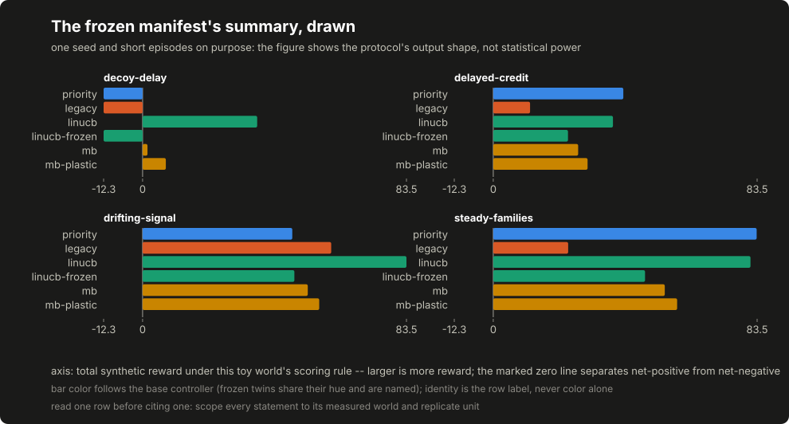

# Lesson 15: comparisons you can hand to a skeptic

The course now holds five selection policies and a shelf of synthetic worlds, which is exactly the moment comparisons start going wrong: a seed chosen after peeking, a summary computed from a run nobody saved, a conclusion that quietly outgrows the world it was measured on. This lesson builds the protocol that keeps a comparison honest (freeze the design, run it, save the raw outputs, compute summaries only from what was saved) and then practices reading the result without claiming more than it holds.

## Build this

`core/controller/research.py`: a frozen manifest with a digest over its own body, a runner that refuses to run anything else, per-condition raw trace files stamped with that digest, and an analysis step that computes the summary table strictly from the saved files. Plus the committed protocol run: manifest, raw directory and summary.

## Start from here

[Lesson 13](13-plasticity-and-credit.md) complete, and the two comparison worlds from lesson 11 still in place. [Lesson 14](14-graph-controller-experiments.md) is optional here: the committed protocol compares no graph arm, and this lesson never requires one.

## Inputs and outputs

The manifest is the whole design, written before anything runs:

```json
{"body": {"schema": "controller-research-manifest/v1",
          "worlds": ["steady-families", "drifting-signal",
                     "delayed-credit", "decoy-delay"],
          "seeds": [7],
          "controllers": [{"name": "priority", "learn": false},
                          {"name": "linucb", "learn": true},
                          {"name": "linucb", "learn": false,
                           "label": "linucb-frozen"}],
          "feedback_weights": "feedback-v1",
          "payout_threshold": 0.5,
          "code_revision": "committed-with-this-tree"},
 "digest": "..."}
```

The committed run covers 6 controller configurations over 4 worlds at 1 seed, giving 24 conditions. That is deliberately tiny. It demonstrates the protocol, not statistical power, and no significance arithmetic is computed over it on purpose: a handful of seeds answers "does the pipeline reproduce" and cannot answer "which policy is better", and pretending otherwise is the exact failure the evidence register exists to catch.

## Implement it

1. **Freeze first.** [`controller/research.py:freeze`](../../core/controller/research.py) canonicalizes the design and stamps [`controller/research.py:manifest_digest`](../../core/controller/research.py) over exactly that body. Everything downstream carries the digest, which is what makes "the runs match the design" checkable instead of asserted.

2. **Refuse drift.** [`controller/research.py:verify_manifest`](../../core/controller/research.py) recomputes the digest before running or analyzing; a manifest edited after freezing (one seed swapped, one world added) is refused with instructions to re-freeze. Changing the design is always allowed; changing it silently is what is not.

3. **Honor the worlds' delays.** [`controller/research.py:run_condition`](../../core/controller/research.py) delivers each outcome `world.delay` steps after its decision and flushes what remains when the episode ends. The delayed-credit and decoy-delay worlds exist for this: a policy whose credit lands on "whatever ran when the reward arrived" falls apart under delay, and the decision-keyed contract from lesson 10 is what keeps attribution attached to the decision that earned it.

4. **Save raw before summarizing.** [`controller/research.py:run_all`](../../core/controller/research.py) writes a raw file per condition (the full trace, the total, the condition and the manifest digest) before any summary exists. [`controller/research.py:analyze`](../../core/controller/research.py) then reads only those files: per condition, the total reward, the regret against the world's best fixed family in hindsight, the repeat ratio (the fraction of steps that chose the same family as the step before), and the first step whose delivered reward cleared the manifest's payout threshold. A condition the manifest names but the raw directory lacks appears as a missing row rather than vanishing, and a raw file produced under a different manifest is refused by name.

5. **Keep the inputs identical.** Every condition draws its candidates, rewards and feedback from the same world generators and the same versioned feedback definition the manifest names. Every condition sees the same worlds, the same seeds and the same feedback definition; the only degree of freedom is the policy, which is the sentence a comparison has to be able to say before its table means anything.

## Run it

```bash
python3 -m pytest tests/test_controller_research.py -q
python3 -m core.controller.research freeze --out /tmp/research-manifest.json
diff -u data/course/research-manifest.json /tmp/research-manifest.json
python3 -m core.controller.research run --manifest data/course/research-manifest.json --raw-dir /tmp/research-raw
python3 -m core.controller.research analyze --manifest data/course/research-manifest.json --raw-dir /tmp/research-raw --out /tmp/research-summary.json
diff -u data/course/research-summary.json /tmp/research-summary.json
```

Both `diff` commands print nothing: the committed manifest is a fresh freeze of the committed configuration, and a fresh run under it reproduces the committed summary exactly.

## Inspect it

[](../../docs/assets/course/research-summary.svg)

Open `data/course/research-summary.json` and practice on a single row. The learning bandit on the decoy world reads: total 36.279849, regret 4.898468 against the best fixed family, repeat ratio 0.932203, first payout at step 3. The scoped reading, in full: on one seed of one synthetic decoy world, under this feedback definition, the learning bandit escaped the decoy and finished near the hindsight baseline. Every clause earns its place; drop "one seed" and the sentence claims replication it does not have; drop "synthetic" and it claims relevance to security testing it does not have; drop "under this feedback definition" and it forgets that reward is a design choice.

The frozen twin is the same arithmetic with learning off: total -12.340526 on the same world, identical to the static baselines, because a frozen bandit with no learned state degenerates to a constant family choice. That pair (learning on against learning off, same policy, same world, same seed) is the cleanest comparison in the table, and it is a comparison of configurations, not of algorithms. Meanwhile the static priority baseline holds regret 0.0 on the delayed-credit world, where the host's static rank happens to be right, and rides the decoy to -12.340526 on the world where it is wrong: the same policy is the best and the worst row depending on the world, which is why no row generalizes past its world.

These results describe synthetic runs with committed inputs and a declared reward rule. They do not establish production performance. The originating project's corrected campaign record (including effective ties on valid outcomes and a tool-error confound larger than the ranking effect) is in [the evidence register](../appendix-f-evidence-register.md). A table cell without uncertainty describes one run; it is not an estimate of performance across runs.

## Break it

```bash
python3 - <<'PY'
import json
import pathlib
import shutil
import tempfile
from core.controller.research import analyze, run_all

manifest = json.loads(pathlib.Path("data/course/research-manifest.json").read_text())
tampered = json.loads(json.dumps(manifest))
tampered["body"]["seeds"] = [8]
try:
    run_all(tampered, "/tmp/research-drifted")
except ValueError as exc:
    print("run refused:", exc)

partial = pathlib.Path(tempfile.mkdtemp()) / "raw"
shutil.copytree("data/course/research-raw", partial)
(partial / "mb--decoy-delay--seed7.json").unlink()
summary = analyze(manifest, partial)
statuses = [row["status"] for row in summary["rows"]]
print("missing:", statuses.count("missing"), "analyzed:", statuses.count("analyzed"))
print("named:", [row["condition"] for row in summary["rows"]
                 if row["status"] == "missing"])
PY
```

Expected output: the edited-but-not-refrozen manifest is refused outright, and a deleted raw file becomes a named missing row while every other condition still analyzes:

```text
run refused: manifest digest does not match its body; re-freeze before running
missing: 1 analyzed: 23
named: ['mb--decoy-delay--seed7']
```

A third direction is worth trying by hand: honestly re-freeze a smaller design and point the analysis at the committed raw directory. It refuses at the first file, by name, because every committed raw file carries the original manifest's digest: a new design cannot quietly harvest an old design's runs.

Then edit any committed raw file by one character and run the artifact sync tests: the summary re-derivation names the file. Rerunning the analysis on the committed raw files reproduces the committed summary byte for byte, and that sentence is a test, not a promise.

### The error pit, reproduced

This is the tool-error-pit exercise [the evidence register](../appendix-f-evidence-register.md) points at: the originating project's corrected campaign record attributes its early "adaptive advantage" readings to runs where a broken tool absorbed a static policy's budget, so the measured difference was tool health, not controller quality. The laboratory carries the confound as a world pair, identical except that the best-paying family's tool is broken in one of them:

```bash
python3 -m core.controller.lab --world error-pit-broken --out /tmp/pit-broken.json
diff -u data/course/compare-error-pit-broken.json /tmp/pit-broken.json
python3 -m core.controller.lab --world error-pit-repaired --out /tmp/pit-repaired.json
diff -u data/course/compare-error-pit-repaired.json /tmp/pit-repaired.json
```

In the broken world the static priority baseline does what a static rank must: it pulls the highest-rated family every step, and every pull is a `tool_error`: 120 of them, for a total of -90.0. The bandit touches the broken tool 1 time, learns from the error feedback, and finishes at 45.586538, so its lead over the baseline reads 135.586538. Repair the tool and rerun: the same two policies, the same seed, and the lead is -1.955577: the baseline is optimal again and the bandit pays its ordinary exploration tax. Now write the sentence the exercise exists for: almost the entire broken-world difference came from tool health, not controller quality. A comparison that does not report tool health beside its totals is reporting the pit, not the policies. Note also what the hindsight bar did: the broken world's best fixed family is not the broken one, because hindsight is computed over effective rewards: an unreachable table value cannot set the regret bar.

### One condition, two labels

The second interpretation trap is already in this book's own data. [Appendix D](../appendix-d-verifier-study.md)'s frozen ground-truth list double-counts one condition (the login injection appears as an auth-bypass entry and as a sqli entry at the same endpoint) and the published statistics carry both the as-scored recall and the deduplicated sensitivity. Do not read the deduplicated block; derive it. The statistics file names the merged pair by entry id, and the per-run match lists are committed, so the whole block recomputes from the artifact readers receive:

```bash
python3 - <<'PY'
import json
import statistics

stats = json.load(open("data/stats.json"))["benchmark"]["verifier_ablation"]
dedup = stats["recall_dedup"]
pair = set(dedup["duplicate_pair"]["ids"])
runs = json.load(
    open("data/benchmark/verifier-study/study-results.json"))["runs"]
for arm in ("FULL", "NOVERIFY"):
    scores = []
    for row in runs:
        if row["arm"] != arm:
            continue
        matched = set(row["P5_gt_matched"])
        # The union rule: the pair counts once when either entry matched,
        # every other entry counts unchanged, denominator nineteen.
        scores.append((len(matched - pair) + bool(matched & pair)) / 19)
    print(arm, "median:", round(statistics.median(scores), 3),
          "published:", dedup[arm + "_median"])
print("pair ids:", sorted(pair))
print("both entries matched in every run:",
      all(pair <= set(r["P5_gt_matched"]) for r in runs))
PY
```

Expected output:

```text
FULL median: 0.211 published: 0.211
NOVERIFY median: 0.158 published: 0.158
pair ids: ['juice-auth-001', 'juice-sqli-002']
both entries matched in every run: True
```

A double-counted ground-truth condition moves both arms by the same rule, and the declared scoring unit travels with the number. The published deduplicated block derives from the committed per-run matches, not from a summary someone once wrote down. That last sentence earned its place the hard way: an earlier version of the statistics described the pair in words without naming the entry ids, an independent recheck of this book paired the auth entry with the wrong sqli entry (the product-search injection, a genuinely distinct condition) and got a different p-value from the same committed matches. Both were doing the arithmetic right; the package had left the scoring unit ambiguous. The correction note in `data/stats.json` keeps that episode on the record, and the rule it teaches is the one to carry into your own comparisons: declare the scoring unit before scoring, identify merged labels by id rather than by description, and when labels can overlap, publish the deduplicated sensitivity beside the headline instead of choosing the flattering one.

## Check completion

- The error-pit pair separates tool health from controller quality: the broken world's lead collapses when the tool is repaired.
- Hindsight in a broken world is computed over effective rewards, so an unreachable table value cannot set the regret bar.
- A double-counted ground-truth condition moves both arms by the same rule, and the declared scoring unit travels with the number.
- The published deduplicated block derives from the committed per-run matches, not from a summary someone once wrote down.

- Every raw condition file carries a digest over its own body, and analysis refuses a file edited after the run.

- The runner refuses a manifest whose digest does not match its body.
- A raw file produced under a different manifest is refused by name.
- A condition the manifest names but the raw directory lacks appears as a missing row rather than vanishing.
- Rerunning the analysis on the committed raw files reproduces the committed summary byte for byte.
- Every condition sees the same worlds, the same seeds and the same feedback definition.
- A completed run, a useful effect and a production-ready controller are three different facts.

Each sentence is a named test in `tests/test_controller_research.py` or `tests/test_error_pit.py`; completion is those suites green plus the two byte-identical `diff` runs above.

## Continue

[The next lesson](16-package-your-agent.md) in the build sequence assembles the whole course into one configuration-driven application around the reader's own provider and controller choices. Deliberate simplification to carry forward: this protocol runs synthetic worlds only; the originating project's live-lab protocol adds disposable targets with reset and health checks, and its evidence register entry (not this lesson) is where its results live.
